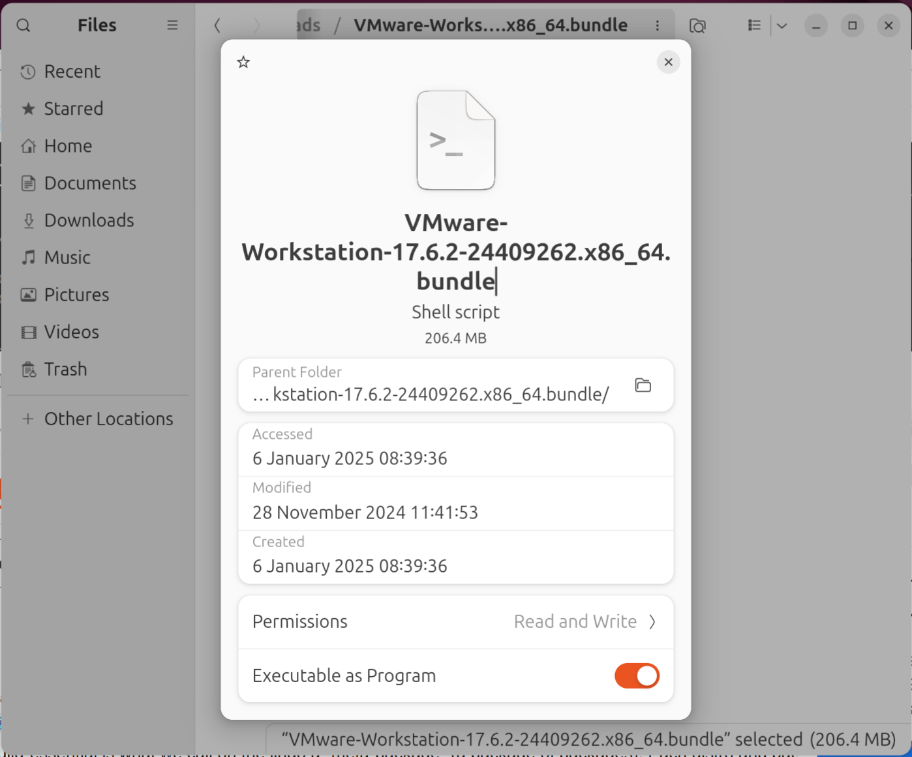
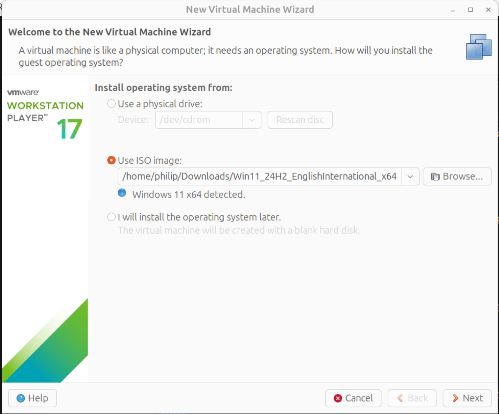

# VMware Workstation Pro Install Ubuntu

This guide looks at installation of VMware Workstation Pro on Ubuntu 24.04 or 24.10. VMware has recently been acquired by Broadcom and VMware Workstation has been made free for non-commercial use.

## Installing VMware Perquisites

VMware is written using C++ and requires the following perquisite packages such as the GNU Compiler Collection and build essential which is a package group that contains packages required for C++ development. Open up the Terminal and input:

```bash
sudo apt install gcc-12 libgcc-12-dev build-essential
```


Input `y`:


The perquisite packages are now installed:


## Downloading VMware Workstation

Although a number of improvements have been made in VMware itself. The front-end to the website redirects to the Broadcom website:

* [Broadcom: Download VMware Workstation Pro](https://www.vmware.com/products/desktop-hypervisor/workstation-and-fusion)

There have been a number of issues logging in to the Broadcom website:


If there are issues the backend to the software downloads can be used:

* [VMware Workstation](https://softwareupdate.vmware.com/cds/vmw-desktop/ws/)

Download the compatible version of VMware Workstation from VMware. This is in the core folder and has the extensions `.bundle.tar`.


## Installing VMWare Workstation

Extract the `.tar` to get to the extracted folder with the `.bundle` file. 


Right click the `.bundle` file and select properties:


Select Executable as Program:



To change permissions to executable input the following command into the terminal with a space (but don't run this command):

```bash
chmod +x 
```

Drag and drop the bundle file into the terminal to complete the command and run:


This command changes the permissions of a file to execution. Now that the file is executable it can be run as a super user. Input the following command with a space (but don't run this command):

```bash
sudo 
```

Drag and drop the bundle file into the terminal to complete the command and run:


VMware Player is now installed and displays in the start screen: 


Launch VMware Player, accept the license agreement and select Next:


Select Yes and Next:


Opt in or out of the customer experience program and select Next:


To compile the kernel modules (requires the perquisites packages to perform the compiling) and install them system wide, authentication is required. Input your password and select authenticate:


## Configuring a Windows 11 VM

Windows 11 has relatively high system requirements such as an 8th generation processor, 8 GB of RAM and a 1 TB SSD boot drive. To run Windows 11 as a VM, the host PC should significantly exceed these system requirements and therefore have a high end 11th generation processor, at least 16 GB of RAM and at least a 512 GB SSD. Go to Settings, to the left hand side select System:


Then select About:


A Windows 11 ISO can be downloaded from Microsoft:

* [Windows 11](https://www.microsoft.com/en-us/software-download/windows11)

Select the Windows 11 ISO and select Download now:


Select the Language and select Confirm:


Select 64 Bit Download:


The ISO will download:


Select File → Create a New Virtual Machine:


Select the Windows 11 ISO and select Open:


Windows 11 will automatically be detected and the default VM settings for Windows 11 will be applied:



The name and location of the VM will be shown. Select Next:


Windows 11 requires an encryption key for the TPM. Input an 8 digit password and confirm the password:


The default disk size is 64 GB. This can be expanded if more disk space is required:


Select Next:


Select Close:


The VM will attempt to launch however will be unable to access the virtual monitor kernel module vmmon because it is blocked by Secure Boot:


An error message, failed to start monitor device will display:


## Configuring Secure Boot

Secure Boot will block the Virtual Monitor Kernel Module and Virtual Network Adaptor Module. A Machine Owner Key (MOK) must be created which signs these modules.

Generate a new Machine Owner Key:

```bash
openssl req -new -x509 -newkey rsa:2048 -keyout VMWARE17.priv -outform DER -out VMWARE17.der -nodes -days 36500 -subj "/CN=VMWARE/"
```

Sign the kernel module vmmon:

```bash
sudo /usr/src/linux-headers-$(uname -r)/scripts/sign-file sha256 ./VMWARE17.priv ./VMWARE17.der $(modinfo -n vmmon)
```

Sign the kernel module vmnet:

```bash
sudo /usr/src/linux-headers-$(uname -r)/scripts/sign-file sha256 ./VMWARE17.priv ./VMWARE17.der $(modinfo -n vmnet)
```

Importing the MOK with MOK management system:

```bash
sudo mokutil --import VMWARE17.der
```

In the terminal create a MOK password for example:

```
vmware1234
```

Confirm the password:

```
vmware1234
```

Input:

```bash
sudo reboot
```

In the BIOS Setup, select Enrol MOK and supply the password above:

```
vmware1234
```

This section may need to be repeated after a significant update.

## Installing Windows 11 in a VM


## Uninstall VMware Workstation

```bash
cd /usr/bin
```

```bash
sudo vmware-installer -u vmware-workstation
```