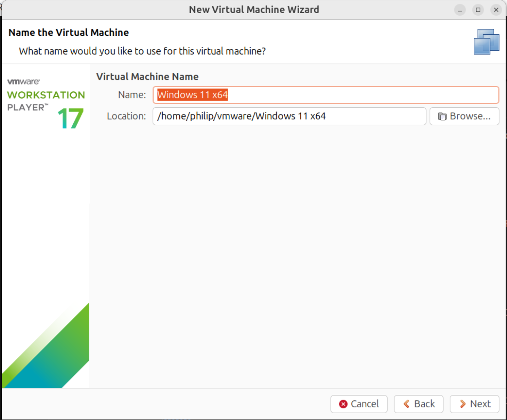
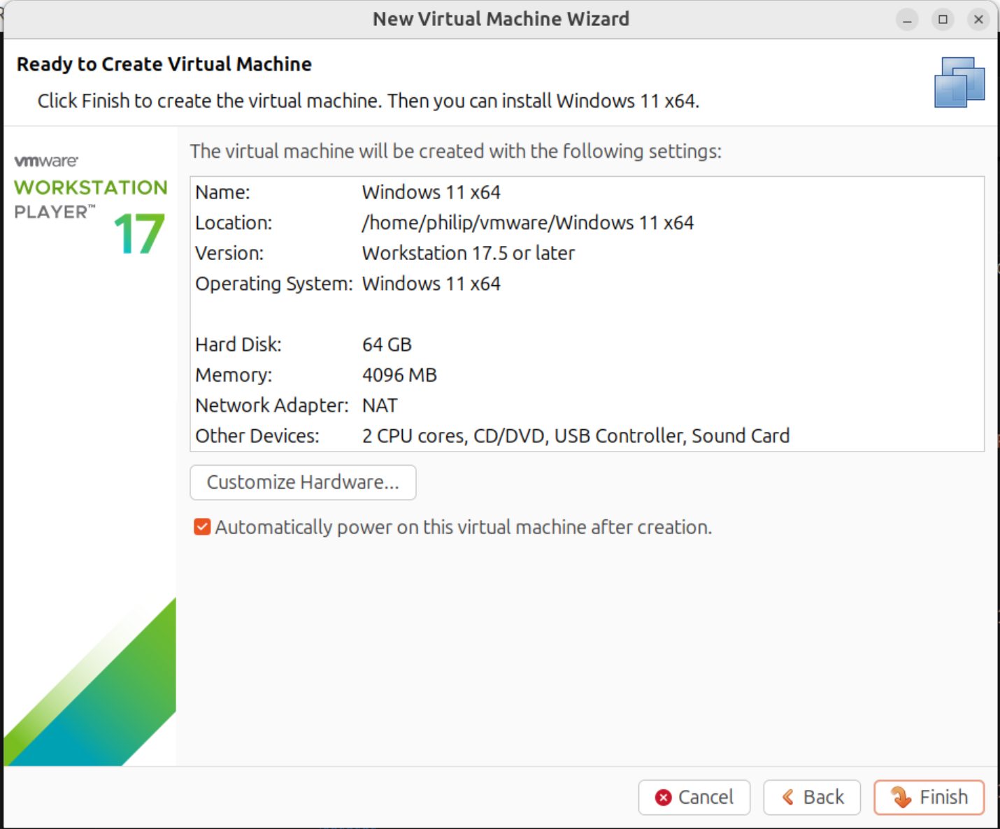
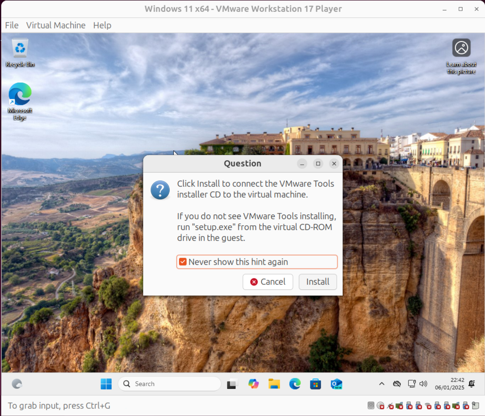
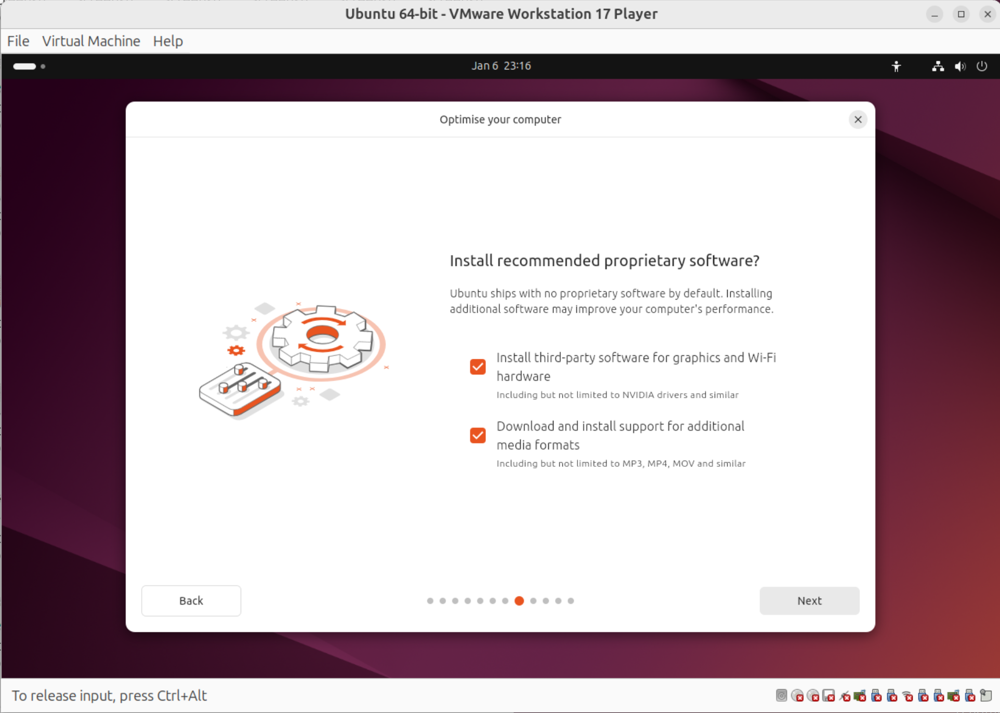

# VMware Workstation Pro Install Ubuntu

This guide looks at installation of VMware Workstation Pro on Ubuntu 24.04 or 24.10. VMware has recently been acquired by Broadcom and VMware Workstation has been made free for non-commercial use. The previous free lesser products have been depreciated in order to reduce development costs.

## YouTube Video

* [YouTube](https://www.youtube.com/watch?v=lcGVWj8q46U)

## Installing VMware Perquisites

VMware is written using C++ and requires the following perquisite packages such as the GNU Compiler Collection and build essential which is a package group that contains packages required for C++ development. Open up the Terminal and input:

```bash
sudo apt install gcc-12 libgcc-12-dev build-essential
```


Input `y`:


The perquisite packages are now installed:


## Downloading VMware Workstation

Although a number of improvements have been made in VMware itself. The front-end to the website redirects to the Broadcom website:

* [Broadcom: Download VMware Workstation Pro](https://www.vmware.com/products/desktop-hypervisor/workstation-and-fusion)

There have been a number of issues logging in to the Broadcom website:


If there are issues the backend to the software downloads can be used:

* [VMware Workstation](https://softwareupdate.vmware.com/cds/vmw-desktop/ws/)

Download the compatible version of VMware Workstation Player from VMware. This is in the core folder and has the extensions `.bundle.tar`.


## Installing VMWare Workstation Player

Extract the `.tar` to get to the extracted folder with the `.bundle` file. 


Right click the `.bundle` file and select properties:


Select Executable as Program:


To change permissions to executable input the following command into the terminal with a space (but don't run this command):

```bash
chmod +x 
```

Drag and drop the bundle file into the terminal to complete the command and run:


This command changes the permissions of a file to execution. Now that the file is executable it can be run as a super user. Input the following command with a space (but don't run this command):

```bash
sudo 
```

Drag and drop the bundle file into the terminal to complete the command and run:


VMware Workstation Player is now installed and displays in the start screen: 


Launch VMware Player, accept the license agreement and select Next:


Select Yes and Next:


Opt in or out of the customer experience program and select Next:


To compile the kernel modules (requires the perquisites packages to perform the compiling) and install them system wide, authentication is required. Input your password and select authenticate:


## Configuring Secure Boot

An attempt to launch a VM will fail because access the virtual monitor kernel module vmmon because it is blocked by Secure Boot:


An error message, failed to start monitor device will display:


Secure Boot will block the Virtual Monitor Kernel Module and Virtual Network Adaptor Module. A Machine Owner Key (MOK) must be created which signs these modules. Open the Terminal:


Navigate to Documents in the terminal using the command change directory `cd`:

```bash
cd ~/Documents
```


Create a new directory called mok using the command make directory:

```bash
mkdir mok
```

Navigate to this directory using:

```bash
cd mok
```


Generate a new Machine Owner Key:

```bash
openssl req -new -x509 -newkey rsa:2048 -keyout VMWARE17.priv -outform DER -out VMWARE17.der -nodes -days 36500 -subj "/CN=VMWARE/"
```


The following files will be created:


Sign the kernel module vmmon:

```bash
sudo /usr/src/linux-headers-$(uname -r)/scripts/sign-file sha256 ./VMWARE17.priv ./VMWARE17.der $(modinfo -n vmmon)
```


Sign the kernel module vmnet:

```bash
sudo /usr/src/linux-headers-$(uname -r)/scripts/sign-file sha256 ./VMWARE17.priv ./VMWARE17.der $(modinfo -n vmnet)
```


Importing the MOK with MOK management system:

```bash
sudo mokutil --import VMWARE17.der
```


In the terminal create a MOK password for example:

```
vmware1234
```


Confirm the password:

```
vmware1234
```


Reboot using:

```bash
sudo reboot
```


The system will reboot to BIOS:


And display MOK management:


Select Enrol MOK:


Select Continue:


Select Yes:


Input the MOK created earlier:

```
vmware1234
```

Select Reboot:


**This section may need to be repeated after a significant VMware or Ubuntu update.**

## Windows Guest

Instructions are similar for both Windows 10 and Windows 11 Guests.

### System Requirements

Windows 11 has relatively high system requirements such as an 8th generation processor, 8 GB of RAM and a 1 TB SSD boot drive. To run Windows 11 as a Virtual Machine, the host PC should significantly exceed these system requirements and therefore have a high end 11th generation processor, at least 16 GB of RAM and at least a 512 GB SSD. Go to Settings, to the left hand side select System:


Then select About:


### Download ISO

A Windows ISO can be downloaded from Microsoft:

* [Windows 11](https://www.microsoft.com/en-us/software-download/windows11)
* [Windows 10](https://www.microsoft.com/en-gb/software-download/windows10ISO)

\* Microsoft removed old Windows 10 Builds and Windows 8.1 after Windows 8.1 reached end of life.

Select the Windows 11 ISO and select Download now:


Select the Language and select Confirm:


Select 64 Bit Download:


The ISO will download:


### Configure VM

Select File → Create a New Virtual Machine:


Select the Windows 11 ISO and select Open:


Windows 11 will automatically be detected and the default VM settings for the Windows 11 Guest will be applied:


The name and location of the Windows 11 Guest will be shown. Select Next:



Windows 11 requires an encryption key for the TPM. Input an 8 digit password and confirm the password:


The default disk size is 64 GB. This can be expanded if more disk space is required:


Select Next:



Select Close:


### Installing Windows 11 in the Windows 11 Guest VM

The Windows 11 Guest can now be selected. Select Power On:


Select OK:


Select Download and Install:


To authenticate input your password:


Select OK:


The prompt to boot from installation media will have timed out while these prompts display. Select Virtual Machine Power and Restart Guest:


Select Yes:


Select Restart:


Click in the Windows 11 Guest and press a key like `h`:


The Windows 11 Guest will boot from the ISO. Select your language and select Next:


Select the keyboard settings and select Next:


Select Install Windows 11 and accept the agreement, then select Next:


Select I don't have a Product Key:


Select the Windows 11 Edition:


Select Accept:


Select the Virtual Disk0 and select Next: 


Select Install:


Select the country or region:


Select the keyboard layout:


Select Skip:


Input the Device Name:


Select Setup for Personal Use:


A number of updates will download:


After the updates have downloaded, select Sign In:


By default you will be unable to create a Local Account. To get around this select Virtual Machine, Virtual Machine Settings:


Select Network Adaptor and uncheck Connected and Connect at power on:


Press `⇧`+`F10` to open up the command prompt and input:

```powershell
oobe\bypassnro
```


The Windows 11 Guest will reboot:


Select the keyboard layout:


Select skip:


Select I don't have internet:


Input your local account name and select Next:


Input your (optional) local account password and select next: 


Once all the privacy settings have been selected. Select Virtual Machine → Virtual Machine Settings:


Select Network Adaptor and check Connected and Connect at power on:


Windows 11 is now installed:


### Installing VMware Tools

VMware tools are essentially the Virtual Machines device drivers. Select Virtual Machine → Install VMware Tools:


If this is grayed out. Manually download the ISO:

* [VMware Tools ISO](https://packages.vmware.com/tools/releases/)

Use the latest release for Windows 11. Use 11.0.6 for Windows Vista and Windows 7. Use 10.0.12 for Windows XP.

Mount the ISO in the VM and begin the install as normal.

Select Install:



Launch the setup64.exe:


Accept the User Account Control Prompt:


Select Next:


Select Typical and then Next:


Select Install:


Select Finish:


Select Yes to Reboot the Windows 11 Guest:


Now that VMware tools are installed, the Windows 11 Guest can be resized:


Drag and drop from the Ubuntu Host to the Windows 11 Guest works:


But drag and drop from the Windows 11 Guest to the Ubuntu Host doesn't work:


### Shared Folders

A folder can be created in Documents of the Host PC:


Name it VMShared:


Select Virtual Machine → Virtual Machine Settings:


Select Shared fodlers, check always enabled and map as a network drive. Select Add:


Name it VMShared and select Browse:


Navigate to Documents and select the folder VMShared:


Slect Save:


Shared folders display as a network drive in the Windows 11 Guest:


A file from the Windows 11 Guest can be added to it:


And retrieved in the Ubuntu Host:


## Ubuntu Guest

Instructions are similar for both Ubuntu 24.04 and Ubuntu 24.10 Guests.

### System Requirements

To run Ubuntu as a Virtual Machine, the host PC should have a high end 11th generation processor, at least 16 GB of RAM and at least a 512 GB SSD. Go to Settings, to the left hand side select System:


Then select About:


### Download ISO

The Ubuntu 24.10 or 24.04 LTS ISO can be downloaded from Canonical:

* [Download Ubuntu Desktop](https://ubuntu.com/download/desktop)


### Configure VM

Select File → Create a New Virtual Machine:


Under select ISO Image, select Browse:


Select the Ubuntu 24.10 ISO and select open:


Ubuntu 24.10 will be detected:


Input your full name, username and password:


The name and location of the Ubuntu 24.10 Guest will be shown. Select Next:


The default disk size is 20 GB. This can be expanded if more disk space is required:


Select Finish:


### Installing Ubuntu 24.10 in the Ubuntu 24.10 Guest VM

The Ubuntu 24.10 Guest will start booting from the Ubuntu 24.10 Live ISO:


Select your Language:


Select Next:


Select your keyboard layout and then select Next:


Select use wired connection and select Next:


Select Install Ubuntu and select next:


Select Interactive Installation:


Select Default Selection:


Check Install third-party software for graphics and Wi-Fi hardware and Download and install support for additional media formats and select Next:



Select Erase Disk and install Ubuntu:


Input your full name, computer name\*, username\* and password:

\* These should be lower case characters with no spaces, the `-` is the only special character allowed. The user name `philip` becomes the name of the home folder `/home/philip` which is also represented by `~` in the terminal:


Select your time zone and select Next:


Select Next:


Select Reboot Now:


Select Next:


Select Next:


Select Finish:


Ubuntu 24.10 is now installed in the Ubuntu 24.10 Guest Virtual Machine. The system drivers (`open-vm-tools`) are included in the Linux Kernel and do not have to be installed. The Ubuntu 24.10 guest can be maximised to full size:


### Shared Folders

Power off the Ubuntu 24.10 Guest:


Open VMware player, highlight the Ubunti 24.10 Guest and select Virtual Machine Settings. Select Options and Shared Folders. Select Always Enabled and select Add:


Under name select VMShared:


Select the VMShared folder under the Ubuntu 24.04 host Documents folder:


Select OK:


Select Save:


Launch the Ubuntu 24.10 Guest, the shared folder will not automatically be mounted. Under `home` also known as `~` create a folder called `vmshared` where the shared folder can be mounted to:


Launch Startup Applications:


Under name select `VMware Shared Folder`. 

Under command input the following command

```bash
/usr/bin/vmhgfs-fuse .host:/ /home/philip/vmshared -o subtype=vmhgfs-fuse
```

Replacing `philip` with your user name and `vmshared` with the name of the folder. If `vmshared` is under `Documents` use:

```bash
/usr/bin/vmhgfs-fuse .host:/ /home/philip/Documents/vmshared -o subtype=vmhgfs-fuse
```


Restart the Ubuntu 24.10 Guest:


The folder `vmshared` is now mounted as a shared folder:


And the files can be accessed from the Ubuntu 24.10 Guest and Ubuntu 24.04 Host:


## Uninstall VMware Workstation

It is common to uninstall VMware Workstation in order to install the latest version, when a new version is released. Open up the Terminal and change directory to:

```bash
cd /usr/bin
```


```bash
sudo vmware-installer -u vmware-workstation
```

Uninstallation is an operation in a system directory, input your password to authenticate:


Input `y` in order to proceed:


VMware Workstation is now uninstalled:


The latest version of VMware Workstation can now be installed. A MOK for the kernel services blocked by Secure Boot will need to be created.

Return to [VMware Installation Guide](../readme.md)