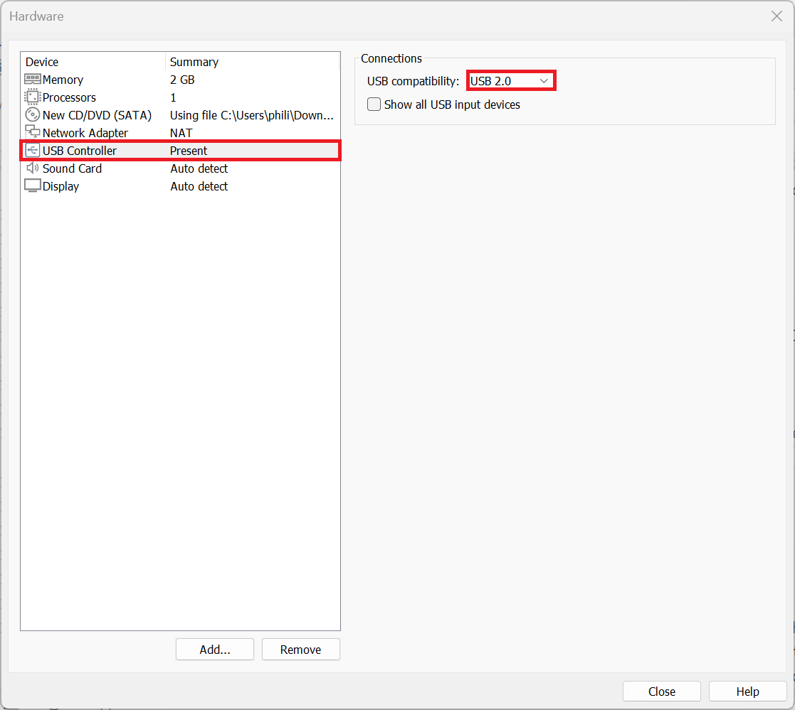
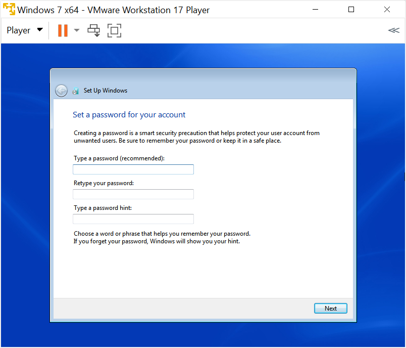

# Windows 7 Guest

Setting up a Windows 7 Guest using VMware Workstation Player.

## YouTube Video

* [YouTube](https://www.youtube.com/watch?v=rZ8DaVV_skk)

## Notes

VMware Workstation Player 17.6.4 has Windows 7 as an option for a Virtual Machine. However Windows 7 is regarded as a legacy Operating System and isn't tested by Broadcom. Moreover the VMware Tools 12.5.3 which comes with VMware workstation player doesn't support Windows 7 and the following errors will display if they are attempted to be installed in the Windows 7 VM:


VMware Tools 11.0.6 is the last version of VMware Tools to support Windows 7 and should be downloaded seperately as an ISO. This ISO should be mounted in the VM so they can be installed manually.

On modern hardware, with a 12th-14th Generation Processor, the following entries should be added to the VMX file:

```
monitor.virtual_exec = "hardware"
monitor.virtual_mmu = "software"
mks.enableVulkanRenderer = "FALSE"
cpuid.0.eax = "0000000X"
cpuid.1.ecx = "00000001"
```

The first setting allows the CPU to optimise the VM performance, the VM may be very slow without this setting. The second setting prevents use of a memory management unit that Windows 7 doesn't understand and can lead to a Blue Screen of Death (BSOD). The third setting prevents VMware from using Vulkan for rendering, which isn't supported by Windows 7 and often leads to black screens. The last two settings prevent Windows 7 from seeing unsupported CPU features which Windows 7 doesn't understand and can lead to a Blue Screen of Death (BSOD).

## Installation Media

### Dell Windows 7 Reinstallation ISO

To download the Dell Windows 7 Professional Reinstallation ISO Media Refresh 2016 (`GDXKK_X8V66A00_W7SP1PRO64_ROW.iso`). Use the Windows ISO Download Tool which downloads the ISO from Dell's servers:

* [Windows ISO Download Tool](https://www.heidoc.net/joomla/technology-science/microsoft/67-microsoft-windows-and-office-iso-download-tool)

Launch the Windows ISO Download Tool:


To the right hand side select Dell, then select Dell OptiPlex 7040, Windows 7 Professional 64 Bit (or 32 Bit) and then Download:


Alternatively the Website Archive.org hosts the ISO file:

|Edition|Architecture|ISO|SHA256|
|---|---|---|---|
|Professional|x64|[GDXKK_X8V66A00_W7SP1PRO64_ROW.iso](https://archive.org/details/dell-windows)|5CCD8F03C950AC590F01125E17090DF3D75E71B3B7BF14FC64B8493BBCB4A4FC|
|Professional|x86|[MT5KY_N6N9GA00_W7SP1PRO32_ROW(DL).iso](https://archive.org/details/dell-windows)|B33B6B5A5C98AD33729741B2F2FE4C74BC7A8677F7C13D0C4966FD9AE5ED2C14|

To check the SHA256, right click the ISO file and select copy as path:


Open up the Windows Terminal and use the command:

```powershell
Get-FileHash "C:\Users\Philip\Downloads\GDXKK_X8V66A00_W7SP1PRO64_ROW.iso"
```


### WSUS Offline Update

The Website Archive.org hosts the ISO created from WSUS Offline Update before Microsoft removed Windows 7 downloads from their download servers. Select `wou-w61-x64 [2023-v1].iso` for Windows 7 64 Bit or `wou-w61-x86 [2023-v1].iso` for Windows 7 Bit respectively.

|ISO|SHA256|
|---|---|
|[wou-w61-x64 \[2023-v1\].iso](https://archive.org/details/windows7updates24)|Unavailable|
|[wou-w61-x86 \[2023-v1\].iso](https://archive.org/details/windows7updates24)|Unavailable|

### VMware Tools ISO

The Windows 7 drivers for the Windows 7 Guest are contained in the VMware Tools Installation ISO. The Website Archive.org appears to host the ISO created by VMware before Broadcom removed it:

|ISO|SHA256|
|---|---|
|[VMware Tools Version 11.0.6](https://archive.org/details/vmware-tools-windows-11.0.6-15940789)|8F1CC3181055891B98672F715E0CA7BBE4018960EAE945D7A4B9F640C44C3D79 |


## Windows 11 Host or Ubuntu 24.10 Host System Requirements

Your Windows 11 Host PC or Ubuntu Host PC should satisfy the minimum system the system requirements of Windows 11 and have additional overhead to run a Virtual Machine in addition to these requirements. It is recommended to have a Host PC with at least:

* i5 or i7 11th Generation Intel Processor or Newer
* 16 GB RAM
* 1 TB SSD

## Configuring Virtual Hardware for a Windows 7 Guest

Select File → New Virtual Machine:


Select I will Isntall the Operating System Later:


**Note do not select Isntaller Disc Image File (ISO) in this screen because VMware will use the asy install which will override the `sources/$OEM$` folder and the `sources/ei.cfg` file, essentially converting the OEM ISO to retail and prompt for a Retail Product Key.**

Select Microsoft Windows and Windows 7 x64 or Windows 7 x86 and select Next:


Use the default Virtual Machine Name and Location (if Documents is integrated with OneDrive, you may want to move this to a local only location) and select next:


Note the name and location as these will be used later.

The default maximum size of the Windows 7 Guest is 40 GB which is too small, I recommend increasing this to 256 GB. Note the files on the Windows 11 Host won't be 256 GB but can be up to 256 GB if the Windows Vista Guests Virtual Drive is fully occupied with files:


Select customise hardware...


The default memory used by the Windows 7 Guest is 2048 MB (2.0 GB). If the Windows 11 Host PC has ≥16 GB RAM, this can be upped to 4096 MB (4 GB) for increased performance of the VM. Note if the Windows 11 Host PC has ≤8 GB of RAM, setting the RAM to 4096 MB (4 GB) may throttle the Host PC leading to decreased performance and 2048 MB (2 GB) may be more approprate:


The default number of processors cores used by the Windows 7 Guest is 1. This can be upped to 2 or 4 if the Windows 11 Host has a processor with ≥ 16 cores. If the Windows 11 Host PC has ≤16 cores, setting this to a higher value may throttle the Host PC leading to an overall decreased performance:


Under CD/DVD select browse:


Load the Dell Windows 7 Professional Media Refresh 2016 Reinstallation x64 (64 Bit) or x86 (32 Bit) ISO:


Ensure connected at power on is enabled:


Windows 7 has reached end of life and should be deemed unsafe to use online. The virtual network adaptor is connected by default and can optionally be disabled:


The default USB Controller for Windows 7 is USB 2.0 as the Windows 7 SP1 Installation ISO provided in 2011 lacked the storage controller for newer hardware preventing the mouse and keyboard from working during the Windows Setup when attached to a USB 3.0 port:



The Windows 7 Professional Index of the Dell Windows Windows 7 ISO was updated in 2016 to contain USB 3.0 drivers so this can be changed to USB 3.0:


The default Sound Card can be used for the Windows 7 Guest:


The default Display can be used for the Windows 7 Guest:


Select Close and Finish:


## Windows 7 Guest Virtual Machine Configuration File

Navigate to the directory on the Windows 11 Host that the Windows 7 Guest is installed: 


Look for the `Windows 7 x64.vmx` file:


Open in Notepad or Notepad++ (recommended):


Press `Ctrl+f` to begin a search for an option for example `bios.bootDelay`:


If the line exists it can be modified to a new value. In this case it doesn't exist so can be appended to the end:

```
bios.bootDelay = "20000"
```


The command above will change the time the Windows 7 Guest Virtual BIOS displays before selecting the default boot option giving more time to select the option to boot from CD/DVD. This line can be removed post-installation.

### Modern Generation Processors (11-14th Generation)

Certain legacy settings may need to be configured to run older guest operating systems such as Windows 7:


Legacy CPU settings:

```
cpuid.0.eax = "0000000X"
cpuid.1.ecx = "00000001"
```

These settings help emulate older CPU instructions that XP expects.

Legacy monitor / virtualization settings

```
mks.enableVulkanRenderer = "FALSE"
```

This disables the Vulkan renderer, forcing VMware to use a more compatible DirectX/software renderer.

Legacy monitor / virtualization settings:

```
monitor.virtual_exec = "hardware"
monitor.virtual_mmu = "software"
```

These settings ensure proper CPU and MMU handling for legacy guests.

### OEM SLP

OEM SLP is not applied by default:

<details>
  <summary>SLIC 2.1 Passthrough</summary>

If the Windows 11 Host PC came with a Windows 10 Professional OEM License, it has upgrade rights to Windows 11 Professional and downgrade right to Windows 7 Professional. The downgrade rights to Windows 7 Professional can be used by passing through the SLIC 2.1 to the Virtual Machine by adding the line to the Virtual Machines Configuration File:

```
acpi.passthru.slic = "TRUE"
acpi.passthru.slicvendor = "TRUE"
SMBIOS.reflecthost = "TRUE"
```

Note if the Windows 11 Host PC doesn't have a SLIC 2.1, the above lines of code will prevent the Windows 7 Guest from booting and should be removed.

</details>

<details>
  <summary>Modded ROMs</summary>

The my digital life forums has a post about a modded Virtual BIOS which includes a Dell SLIC 2.1 compatible with Dell Windows 7 Professional OEM SLP. These ROMs are not supported by Microsoft or Dell (but then neither is Windows 7). You will need to log into their forums to view the files:

* [My Digital Life: SLIC 2.1 Mod](https://forums.mydigitallife.net/threads/vmware-workstation-esxi-bios-efi-slic-mod.64693/#post-1132133)

Extract the downloaded file and navigate to the `17.6.0 Modded ROMs` folder. Rename `WORKSTATION_17.6.0_DELL2.7_SLIC_EFI20-64.ROM` to `EFI20-64.ROM` and copy the modded ROM to the directory of the Windows 7 Guest. Update the Virtual Machine Configuration file to:

```
efi20-64.filename = "modded_EFI20-64.ROM"
```

Note if the corresponding ROM is not found in the directory the above line of code will prevent the Windows 7 Guest from booting.

</details>

## Installing the Windows 7 Guest OS

Select the Windows 7 Virtual Machine and select Play:


Loading files will display:


Starting Windows will display:


The Dell Windows 7 Reinstallation .iso is multi-lingual, select your language:


Select your Time and Currency Format and select Next:


Select Install Now:


Accept the License Agreement and select Next:


Select Custom Advanced:


Select Disc 0: Unallocated Space and select Next:


Input your User Name and PC Name:


Select Next:



Select Next:


Select Home Network, or use the Virtual Machine Settings to disconnect the Virtual Network Adaptor:


## Installing Windows Updates


## Installing VMware Tools

Select Player → Removable Devices → CD/DVD → Settings:


Load the `VMware-tools-windows-11.0.6-15940789.iso`:


Open up Windows Explorer and navigate to the optical drive:


Select setup64 on Windows 7 64 Bit or setup on Windows 7 32 Bit:


Accept the User Account Control Prompt:


Select Next:


Select Next:


Select Next:


Select Install:


Select Finish:


Select Yes:


The Windows 7 Guest will restart and the window in the Windows 11 Host can now be resized, resizing the Windows 7 Guest:


If Computer is right clicked and properties selected:


To the bottom, the Activation status will display. This Windows 7 Guest is not activated because the VM does not have a SLIC 2.1. The Windows 7 Guest is activated when a SLIC 2.1 is passed through from the Windows 11 Host or Ubutun 24.10 Host.

To the left the Device Manager will display:


The drivers should be installed:


On a Windows 11 Host, drag and drop to the Windows 7 Guest is bi-directional. On a Ubuntu Host, drag and drop from the Ubuntu Host to the Windows 7 Guest works but does not work from the Windows 7 Guest to Ubuntu Host (Shared Folders can be configured for that). The Standalone Updates can be copied to Downloads:


Note install the updates in the order listed above and not by the KB numbers, as some updates require other updates as perquisites. When the last update is installed and the Windows 7 Guest has restarted you will be informed that Windows 7 has Reached End of Life:


## Shared Folders

Create a new folder on the Windows 11 Host or Ubuntu 24.10 Host PC called `vmshared`:


Select Player → Manage → Virtual Machine Settings:


Select Options → Shared Folders and change the setting to Always Enabled and check Map Network Drive:


Select Add, select the folder vmshared on the Windows 11 Host PC or Ubuntu 24.10 Host PC and then next:


Select Enable this Share and Finish:


Close the Virtual Machine Settings:


The shared folder is now mapped as a network drive in the Windows 7 Guest:


And the file created on the Windows 7 Guest in this shared folder:


Can be accessed by the Windows 11 Host or Ubuntu 24.10 Host:


## Installing Python

Python will be used as an example of installing a program on Windows Vista. [python-3.7.0-amd64.exe](https://www.python.org/downloads/release/python-344](https://www.python.org/downloads/release/python-370/#files) is the latest version of Python to work on Windows Vista. The installer can be downloaded on the Windows 11 Host PC:


When using a Windows 11 Host, the file can be dragged and dropped over to the VM. On a Linux host, the most commonly used Desktop Environment GNOME (and less common Desktop Environments) are not supported and shared folders have to be configured:


Launch the setup:


Select add to path and then select install now:


Select close:


Open the Command Prompt:


To launch Python input:

```powershell
python
```

Notice the change to the Python prompt `>>>`:


Python code can now be used:

```python
print('Hello World!')
```


To exit python input the function:

```python
exit()
```


Notice the return to the CMD prompt. 

To use the package manager requires Internet Connectivity. Select Player → File → Network Adaptor → Connect:


Recall however that Windows Vista is past end of life and is not safe to use online for general web use.

The globe icon will appear to the bottom right corner:


The Python package can be installed using:

```powershell
pip install pyserial==3.0.1
```


And can be imported into a Python program:


## USB Passthrough

A legacy USB Device can be passed through from the Windows 11 Host or Ubuntu 24.10 to the Windows Vista Guest. In this example a Logitech Pro 9000 webcam will be used. The Logitech Pro 9000 is a USB 2.0 camera which had HD 720p (1280×720 pixels) and 30 fps which is effectively at the limit of USB 2.0. The Windows XP driver and software can be downloaded on the Windows 11 Host:


The installer can be copied to `vmshared` or directly dragged and dropped from the Widnows 11 Host to the Windows Vista Guest:


Select Computer:


Shared Folders:


And the `vmshared` folder:


Launch the installer:


Select Run:


Accept the Usr Account Control Prompt:


Select next:


Attach the USB Device, in this case the Logitech Pro 9000 to the USB Port. VMware will show the New USB Device Detectd Dialog which will allow you to connect the USB either to the Host or the VM:


When prompted to connect the webcam, pass through the USB device from the Windows 11 Host to the VM using Player → Removable Devices → Logitech USB Device → Connect:


Select OK:


The found new hardware wizard will show:


Select next:


Select next:


The image from the webcam displays, select next:


Select check out my webcam:


Select Quick Capture:


The webcam software can be used in the Windows Vista Guest to control the Logitech Pro 9000 which has been passed through from the Windows 11 Host PC:


## Serial Port Passthrough

Close the Windows Vista VM. Attach a USB to Serial Port to the Window 11 Host PC:


On the Windows 11 Host PC, right click the Start Button and select Device Manager:


Expand ports (COM & LPT). In this example, the USB Serial COM Port is COM3:


Right click it and select properties:


The Baud rate will be shown, in this case 9600 Bits per second. Update this to match the speed the device you want to connect expects:


In this case it will be left at port 3:


Open VMware Player and select Edit Virtual Machine Settings:


Select Add...:


Select Serial Port and Finish:


Select Connect at Power On. Autodetect is useful for a single port, but for multipe ports, it is more useful to select the serial Port indiviually. In this example COM3 will be used:


Select ok:


Launch the VM:


Right click computer and select properties:


Select Device Manager:


Select Continue:


Expand ports, note the Windows 11 COM3 is passed through to the Windows 2000 VM as COM1:


Right click the communication port and select properties:


The Baud rate will be shown, in this case 9600 Bits per second. Update this to match the speed the device you want to connect expects (consistent with the settings on the Windows 11 Host):


Select Advanced:


Update the COM Port Number to be consistent with the Windows 11 Host. In this case COM3. Select OK:


The Serial Port COM3 now displays correctly in the device manager but is not available for use in other programs until the Windows Vista VM is restarted:


I don't have a device that connects via Serial Port, so will test the Serial Port using Python with pyserial. The Serial Port looks like the following:


|Pin Number|Name|
|---|---|
|1|Data Carrier Detect (CDC)|
|2|Received Data (RXD)|
|3|Transmit Data (TXD)|
|4|Data Terminal Ready (DTR)|
|5|Ground (GND)|
|6|Data Set Ready (DSR)|
|7|Request to Send (RTS)|
|8|Clear To Send (CTS)|
|9|Ring Indicator (RI)|

A Python script will be used which essentially transmits the data using pin 3 and then reads it back using pin 2. A Serial port can only read low `0` and high `1` signals, so any data sent via the Serial Port has to be in the form of a byte. In the basic American Standard for Information Interchange (ASCII), each ASCII character is an 8 bit binary sequence:

| Char | Decimal | Hex  | Binary    |
|------|---------|------|-----------|
| H    | 72      | 0x48 | 01001000  |
| e    | 101     | 0x65 | 01100101  |
| l    | 108     | 0x6C | 01101100  |
| l    | 108     | 0x6C | 01101100  |
| o    | 111     | 0x6F | 01101111  |
| (space) | 32   | 0x20 | 00100000  |
| S    | 83      | 0x53 | 01010011  |
| e    | 101     | 0x65 | 01100101  |
| r    | 114     | 0x72 | 01110010  |
| i    | 105     | 0x69 | 01101001  |
| a    | 97      | 0x61 | 01100001  |
| l    | 108     | 0x6C | 01101100  |
| \n   | 10      | 0x0A | 00001010  |

Open notepad:


Paste in the following code:

```python
import time
import serial

# Replace 'COM3' with your serial port
port = 'COM3'
baudrate = 9600

# Open the serial port
ser = serial.Serial(port, baudrate, timeout=1)

time.sleep(2)  # give the port some time to initialize

# Test data
test_data = b'Hello Serial\n'

# Write data
ser.write(test_data)
print(f"Sent: {test_data}")

# Read back data
received = ser.read(len(test_data))
print(f'Received: {received}')

# Check if the loopback worked
if received == test_data:
    print('✅ Serial loopback test passed!')
else:
    print('❌ Serial loopback test failed!')

ser.close()
```


Select file → save as:


Save the file as `script.py` ensuring that save as type is All Files and Encoding is UTF-8:


The script file is in Documents, copy the path:


Launch the script file in the command prompt:


With no pins connected, the following shows:


With pins 2 and 3 connected, the following shows:


The code works as expected and interfaces with the Serial Port which is passed through to the Windows Vista VM from the Windows 11 Host PC.

## Parallel Port Passthrough

VMware can theoretically passthrough a physical parallel port. However, USB-to-parallel adapters are designed exclusively for printers and do not provide true parallel port functionality for other hardware. By the time of Windows Vista, parallel ports were already considered legacy and were rarely included on new PCs. I do not have a parallel port printer available to test passthrough functionality.

## PCI/PCIe Card Passthrough

VMware does not support direct passthrough of PCI or PCIe cards to a guest virtual machine. Additionally, there are no USB adapters that replicate the functionality of PCI/PCIe expansion cards.

Return to [VMware Installation Guide](../readme.md).

Python is just used as an example of a legacy program to run in a Windows Vista VM and not covered in detail in this tutorial. For details about using Python, see my other GitHub repository [Python Tutorials](https://github.com/PhilipYip1988/python-tutorials).
