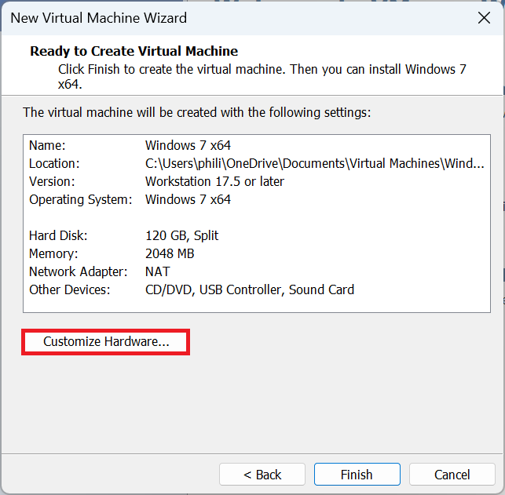
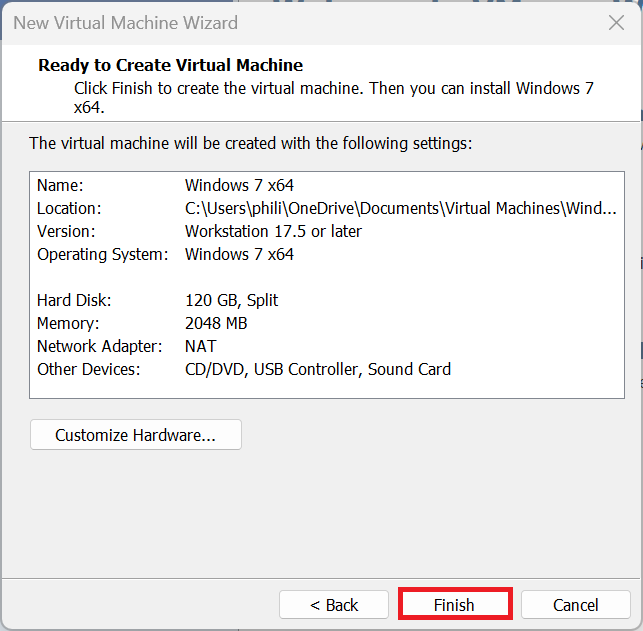
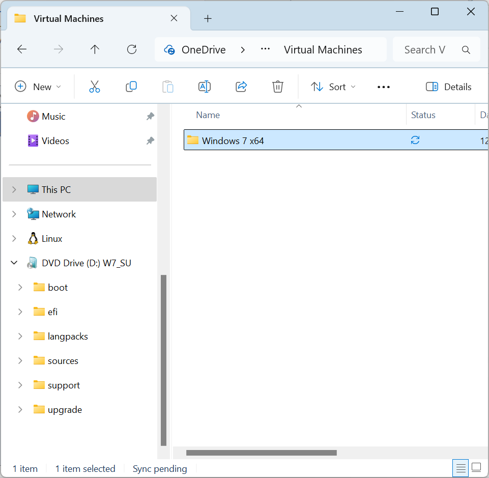
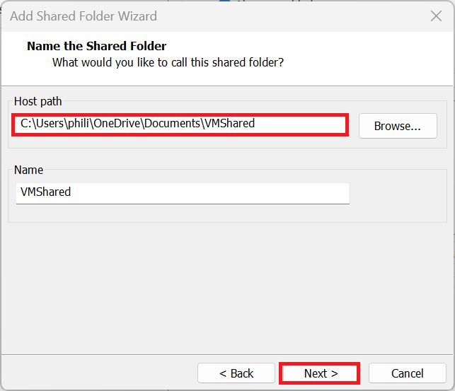
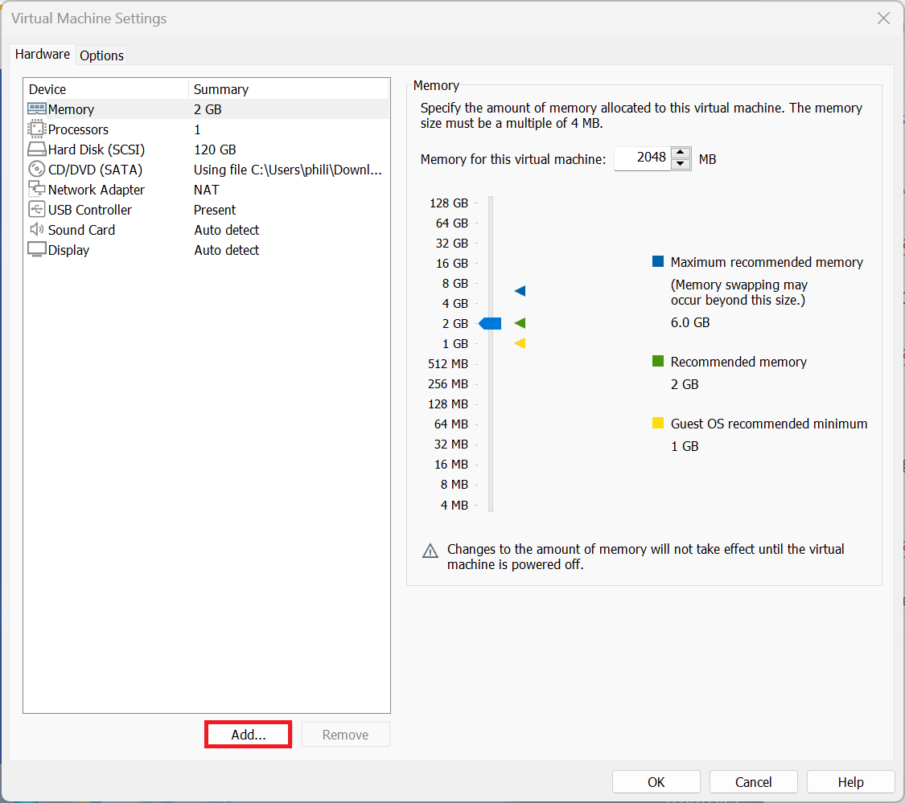

# Windows 7 Guest

Setting up a Windows 7 Guest using VMware Workstation Player.

## YouTube Video

* [YouTube](https://www.youtube.com/watch?v=rZ8DaVV_skk)

## Download Dell Windows 7 Reinstallation ISO

To download the Dell Windows 7 Professional Reinstallation ISO Media Refresh 2016. Use the Windows ISO Download Tool:

* [Windows ISO Download Tool](https://www.heidoc.net/joomla/technology-science/microsoft/67-microsoft-windows-and-office-iso-download-tool)

Launch the Windows ISO Download Tool:


To the right hand side select Dell, then select Dell OptiPlex 7040, Windows 7 Professional 64 Bit (or 32 Bit) and then Download:


## Download Windows 7 Standalone Security Patches

The Windows 7 Professional Index and the Dell Windows 7 Reinstallation ISO was updated in 2016. It is recommended to download the following standalone updates from the Microsoft Update catalog patching the Windows 7 installation to the final Security Rollup in January 2020:

<details>
  <summary>Windows 7 Standalone Updates Microsoft Update Catalog</summary>

**Select the "Windows 7 64 Bit" Package for Windows 7 64 Bit or and "Windows 7" package for Windows 7 32 Bit.**


Convenience Rollup:

* [Service Stack KB3020369](https://www.catalog.update.microsoft.com/Search.aspx?q=KB3020369)
* [Convenience Rollup KB3125574](https://www.catalog.update.microsoft.com/Search.aspx?q=3125574)

Note that a restart is required after installing these updates:

Service Stack Updates for January 2020 Rollup:

* [KB4474419](https://www.catalog.update.microsoft.com/Search.aspx?q=4474419)
* [KB4490628](https://www.catalog.update.microsoft.com/Search.aspx?q=4490628)
* [KB4536952](https://www.catalog.update.microsoft.com/Search.aspx?q=4536952)

Security Rollup:

**Windows 7 Reached End of Life in January 2020 so this is the final Security Rollup.**

* [Security Rollup KB4534310](https://www.catalog.update.microsoft.com/Search.aspx?q=2020-01%20Security%20Monthly%20Quality%20Rollup)

A restart is required after installing these updates. 

Microsoft .Net Framework: 

* [Microsoft .NET 4.7.2 Framework (Offline Installer)](https://support.microsoft.com/en-gb/topic/microsoft-net-framework-4-7-2-offline-installer-for-windows-05a72734-2127-a15d-50cf-daf56d5faec2)
* [Microsoft .NET 4.8.0 Framework (Offline Installer)](https://support.microsoft.com/en-gb/topic/microsoft-net-framework-4-8-offline-installer-for-windows-9d23f658-3b97-68ab-d013-aa3c3e7495e0)

</details>

## WSUS Offline Update

The last version of WSUS Offline Update to support Windows 7 was 11.9:

* ~~[WSUS Offline Update](https://download.wsusoffline.net/)~~

This no longer works as Microsoft removed the downloads WSUS Offline updates uses from their servers.

<details>
  <summary>Archive.org</summary>

The Website Archive.org appears to host the ISO created from WSUS Offline Update before Microsoft removed Windows 7 downloads from their download servers:

* [WSUS Offline Update Windows 7 (Windows 7 32 Bit=w61 and Windows 7 64 Bit=w61-x64)](https://archive.org/details/wsusoffline-eol-windows)

I have tested installation of the ISO in a Virtual Machine but as this is an unofficial source and should be used with caution. 

</details>

## Download VMware Tools ISO

The Windows 7 drivers for the Windows 7 Guest are contained in the VMware Tools Installation ISO. VMware tools for legacy versions of Windows needs to be downloaded from VMware separately:

* [VMware Tools Version 11.0.6](https://packages.vmware.com/tools/releases/11.0.6/windows/)


## Product Activation

OEM SLP activation is not carried out by default when using a Windows 7 Virtual Machine as the Virtual Machine lacks the SLIC 2.1 in the Virtual BIOS by default. This will result in a 30 Day Trial.

On Dell Devices (and Devices manufactured by other major OEMs such as Lenovo and HP) with Windows 10 Pro OEM Licenses such as the OptiPlex 7040, the Host Device has a System License Internal Code 2.1 which is used for OEM Downgrade Rights. This can be passed through to the Windows 7 Guest by modifying the Windows 7 Guests Virtual Machines Configuration File and will result in a Virtual Machine that is activated offline using Dell OEM System Locked Preinstallation (SLP).

<details>
  <summary>30 Day Trial...</summary>

In the vast majority of cases, the Windows 7 Guest will be installed using a Dell OEM SLP key which automatically activates on a Dell PC with a SLIC Version of 2.1. This is not present in the Virtual Machine so Windows 7 will not be activated. Windows 7 will therefore be installed using a 30 Grace Period License (where when Windows 7 was a supported product would give you enough time to buy a license from a retail outlet):

* 1-3 days:

Windows 7 operates normally without any restrictions.

* 4-7 days:

Windows starts showing periodic reminders to activate.

* 28-29 days:

Windows starts showing more prominent reminders to activate.

* 30+ days

Windows enters Reduced Functionality Mode (RFM) where the desktop background turns black and cannot be changed.
Persistent reminders to activate Windows 7 appear. The system remains functional but with constant reminders.

The 30 day grace period can be rearmed by going to start and inputting cmd, right clicking cmd and selecting run as an administrator:

```powershell
slmgr /rearm
```

Microsoft allow rearming up to four times. The rearm count could be reset by opening the registry editor and navigating to:

```
HKEY_LOCAL_MACHINE\SOFTWARE\Microsoft\Windows NT\CurrentVersion\SoftwareProtectionPlatform
```

and then changing the `SkipRearm` value from `0` to `1` and then rebooting.

</details>

<details>
  <summary>Retail Licenses</summary>

The Retail License for Windows 7 is the correct license for a Virtual Machine however:

Online product activation for Windows 7 using a Retail Product key cannot be carried out because Microsoft have decommissioned the Product Activation servers and Windows 7 Retail Product Keys can therefore no longer be used to activate Windows 7 or Windows 11.

Phone product activation to an automated line for Windows 7 using a Retail Product key may still work. You are unlikely to be passed through to a Microsoft employee if the automated process does not work because the product has passed end of life and is no longer supported. You may have issues transferring your Windows 7 Retail License from one Virtual Machine to another.

</details>

## Windows 11 Host or Ubuntu 24.10 Host System Requirements

Your Windows 11 Host PC or Ubuntu Host PC should satisfy the minimum system the system requirements of Windows 11 and have additional overhead to run a Virtual Machine in addition to these requirements. It is recommended to have a Host PC with at least:

* i5 or i7 11th Generation Intel Processor or Newer
* 16 GB RAM
* 1 TB SSD

## Configuring Virtual Hardware for a Windows 7 Guest

Select File → New Virtual Machine:


The installer disc image file (iso) option uses Easy Install:


Easy install ignores the content in the `sources/$OEM$` folder and the `sources/ei.cfg` file, essentially converting the OEM ISO to retail and prompts for a Retail Product Key:


It is recommended to instead use "I Will Install this Operating System Later":


Select Microsoft Windows and Windows 7 x64 or Windows 7 x86 and select Next:


The VM Name and Location will be shown. Note when used on a Windows 11 Host which is signed in with a Microsoft Account and integrated with OneDrive, the default location will be on OneDrive. The VM can be quite large and the location can be changed to local Documents by removing the OneDrive folder:


Note the name and location as these will be used later.

The default maximum size of the Windows 7 Guest is 60 GB which is a bit too restrictive. I recommend increasing this to 120 GB. Note the files on the Windows 11 Host won't be 120 GB but can be up to 120 GB if the Windows 7 Guests Virtual Drive is fully occupied with files:


Select customise hardware...



The default memory used by the Windows 7 Guest is 2048 MB (2 GB). If the Windows 11 Host PC has ≥32 GB RAM, this can be upped to 4096 MB (4 GB) for increased performance in the Windows 7 Guest. If the Windows 11 Host PC has ≤16 GB of RAM, setting this to 4096 MB (4 GB) may throttle the Host PC leading to an overall decreased performance. The task manager can be opened in the Windows 11 Host PC to view the installed memory (RAM):


The default number of processors cores used by the Windows 7 Guest is 1. This can be upped to 2 or 4 if the Windows 11 Host has a processor with ≥ 16 cores. If the Windows 11 Host PC has ≤16 cores, setting this to a higher value may throttle the Host PC leading to an overall decreased performance:


The CD/DVD should be configured to load the Dell Windows 7 Reinstallation ISO:


Windows 7 has reached end of life and should be deemed unsafe to use online. The virtual network adaptor is connected by default and can optionally be disabled:


The default USB Controller for Windows 7 is USB 2.0 as the Windows 7 SP1 Installation ISO provided in 2011 lacked the storage controller for newer hardware preventing the mouse and keyboard from working during the Windows Setup when attached to a USB 3.0 port:


The Windows 7 Professional Index of the Dell Windows Windows 7 ISO was updated in 2016 to contain USB 3.0 drivers so this can be changed to USB 3.0:


The default Sound Card can be used for the Windows 7 Guest:


The default Display can be used for the Windows 7 Guest:


Select Close and Finish:



## Windows 7 Guest Virtual Machine Configuration File

Navigate to the directory on the Windows 11 Host that the Windows 7 Guest is installed: 



Look for the `Windows 7 x64.vmx` file:


Open in Notepad or Notepad++ (recommended):


Press `Ctrl+f` to begin a search for an option for example `bios.bootDelay`:


If the line exists it can be modified to a new value. In this case it doesn't exist so can be appended to the end:

```
bios.bootDelay = "20000"
```


The command above will change the time the Windows 7 Guest Virtual BIOS displays before selecting the default boot option giving more time to select the option to boot from CD/DVD. This line can be removed post-installation.

<details>
  <summary>SLIC 2.1 Passthrough</summary>

If the Windows 11 Host PC came with a Windows 10 Professional OEM License, it has upgrade rights to Windows 11 Professional and downgrade right to Windows 7 Professional. The downgrade rights to Windows 7 Professional can be used by passing through the SLIC 2.1 to the Virtual Machine by adding the line to the Virtual Machines Configuration File:

```
acpi.passthru.slic = "TRUE"
acpi.passthru.slicvendor = "TRUE"
SMBIOS.reflecthost = "TRUE"
```

Note if the Windows 11 Host PC doesn't have a SLIC 2.1, the above lines of code will prevent the Windows 7 Guest from booting and should be removed.

<details>
  <summary>Modded ROMs</summary>

The my digital life forums has a post about a modded Virtual BIOS which includes a Dell SLIC 2.1 compatible with Dell Windows 7 Professional OEM SLP. These ROMs are not supported by Microsoft or Dell (but then neither is Windows 7). You will need to log into their forums to view the files:

* [My Digital Life: SLIC 2.1 Mod](https://forums.mydigitallife.net/threads/vmware-workstation-esxi-bios-efi-slic-mod.64693/#post-1132133)

Extract the downloaded file and navigate to the `17.6.0 Modded ROMs` folder. Rename `WORKSTATION_17.6.0_DELL2.7_SLIC_EFI20-64.ROM` to `EFI20-64.ROM` and copy the modded ROM to the directory of the Windows 7 Guest. Update the Virtual Machine Configuration file to:

```
efi20-64.filename = "modded_EFI20-64.ROM"
```

Note if the corresponding ROM is not found in the directory the above line of code will prevent the Windows 7 Guest from booting.

For Windows Vista extract the downloaded file and navigate to the `17.6.0 Modded ROMs` folder. Rename `WORKSTATION_17.6.0_DELL2.7_SLIC_BIOS.440_(497).ROM` to `modded_BIOS.440.ROM` and copy the modded ROM to the directory of the Windows Vista Guest. Update the Virtual Machine Configuration file to:

```
bios440.filename = "modded_BIOS.440.ROM"
```

Note if the corresponding ROM is not found in the directory the above line of code will prevent the Windows Vista Guest from booting.


</details>

</details>

## Installing the Windows 7 Guest OS

Select the Windows 7 Virtual Machine and select Play:


Select Never Remind Me at the prompt to install VMware Tools.

Loading files will display:


Starting Windows will display:


The Dell Windows 7 Reinstallation .iso is multi-lingual, select your language:


Select your Time and Currency Format and select Next:


Select Install Now:


Accept the License Agreement and select Next:


Select Custom Advanced:


Select Disc 0: Unallocated Space and select Next:


Input your User Name and PC Name:


Select Next:


Select Next:


Select Home Network, or use the Virtual Machine Settings to disconnect the Virtual Network Adaptor:


## Installing VMware Tools

Select Player → Removable Devices → CD/DVD → Settings:


Load the `VMware-tools-windows-11.0.6-15940789.iso`:


Open up Windows Explorer and navigate to the optical drive:


Select setup64 on Windows 7 64 Bit or setup on Windows 7 32 Bit:


Accept the User Account Control Prompt:


Select Next:


Select Next:


Select Next:


Select Install:


Select Finish:


Select Yes:


The Windows 7 Guest will restart and the window in the Windows 11 Host can now be resized, resizing the Windows 7 Guest:


If Computer is right clicked and properties selected:


To the bottom, the Activation status will display. This Windows 7 Guest is not activated because the VM does not have a SLIC 2.1. The Windows 7 Guest is activated when a SLIC 2.1 is passed through from the Windows 11 Host or Ubutun 24.10 Host.

To the left the Device Manager will display:


The drivers should be installed:


On a Windows 11 Host, drag and drop to the Windows 7 Guest is bi-directional. On a Ubuntu Host, drag and drop from the Ubuntu Host to the Windows 7 Guest works but does not work from the Windows 7 Guest to Ubuntu Host (Shared Folders can be configured for that). The Standalone Updates can be copied to Downloads:


Note install the updates in the order listed above and not by the KB numbers, as some updates require other updates as perquisites. When the last update is installed and the Windows 7 Guest has restarted you will be informed that Windows 7 has Reached End of Life:


## Shared Folders

Create a new folder on the Windows 11 Host or Ubuntu 24.10 Host PC called `vmshared`:


Select Player → Manage → Virtual Machine Settings:


Select Options → Shared Folders and change the setting to Always Enabled and check Map Network Drive:


Select Add, select the folder vmshared on the Windows 11 Host PC or Ubuntu 24.10 Host PC and then next:



Select Enable this Share and Finish:


Close the Virtual Machine Settings:


The shared folder is now mapped as a network drive in the Windows 7 Guest:


And the file created on the Windows 7 Guest in this shared folder:


Can be accessed by the Windows 11 Host or Ubuntu 24.10 Host:


## USB Devices

A USB Device can be passed through from the Windows 11 Host or Ubuntu 24.10 to the Windows 7 Guest:


The Device Drivers for the USB Device and software can be installed in the Windows 7 Guest.

## Serial Ports

It is also possible to pass a Serial Port from the Windows 11 Host or Ubuntu 24.10 Host to the Windows 7 Guest. Select Player → Manage → Virtual Machine Settings:


Under hardware select Add...:



Then select Serial Port:


This needs to be done when the Windows 7 Guest is powered off. In this example, the Windows 11 Host doesn't have a Serial Port, so I'm not going to add a Serial Port.

Note the Serial Port number should be configured in the Device Manager in the Windows 11 Host, then added to the Windows 7 Guest, then the Serial Port number should be configured in the Windows 7 Guest. It is recommended to do this one at a time, to avoid confusion between Serial Ports.

The Windows 7 Guest is now setup.

Return to [VMware Installation Guide](../readme.md).