# Windows 98SE

## Windows 98SE ISO

Windows 98SE is considered abandonware and the Windows 98SE ISO and Product Key can be obtained from WinWorld:

* [WinWorld](https://winworldpc.com/product/windows-98/98-second-edition)

Use the OEM Full ISO as the Retail Full ISO doesn't boot in VMware Player without use of a floppy disk and use the provided Product Key. For this version of Windows there was only a Product Key and there was no concept of Product Activation.

## VMware Tools ISO

Windows 98SE requires the Pre2k version of VMware Tools which installs some of the System Drivers such as the virtual display driver and also allows dragging and dropping files to the Windows 98 Guest:

* [VMware Tools Pre2k](https://packages-prod.broadcom.com/tools/frozen/windows/winPre2k.iso)

## Patcher9x

The Windows 98SE installation errors out on a VM on a modern computer:

> This program has performed an illegal operation and will be shut down.

> If the problem persists, contact the program vendor

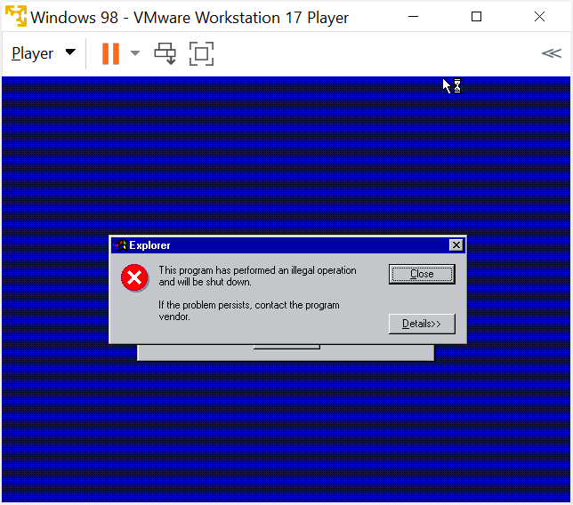

Essentially the processor is too fast and windows 98SE expects to wait more than "zero seconds" for an operation.

Download the `patcher9x.ima` from the assets of the latest release:

* [patcher9x](https://github.com/JHRobotics/patcher9x/releases/)

Right click the downloaded file and select rename: 


Change the file extension from `.ima` to `.img`:


Select Yes:


The virtual floppy disk is now compatible with VMware:

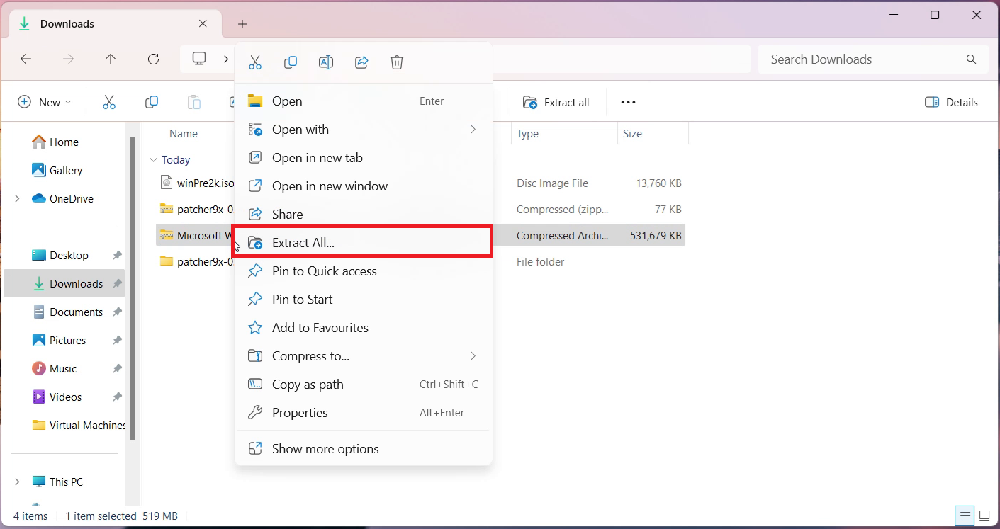

## Intel Chipset Installation Utility

VMware tools is missing the Intel Chipset driver:

* [6.3.0.1007](https://www.philscomputerlab.com/intel-chipset-drivers.html)

## NUSB Storage Driver

VMware tools is missing the NUSB Storage driver

* [NUSB36e](https://www.philscomputerlab.com/windows-98-usb-storage-driver.html)

## Creative SoundBlaster

VMware tools is missing the Creative SoundBlaster driver:

* [Creative SBPCI_WebDrvsV5_12_01.exe](https://support.creative.com/downloads/download.aspx?nDownloadId=1843)

* [Creative eapci8m.ecw](https://support.creative.com/downloads/download.aspx?nDownloadId=1825)

## Windows 98SE Service Pack

An unofficial Service pack for Windows 98 is available:

* [Windows 98SE Unofficial Service Pack](https://www.majorgeeks.com/files/details/unofficial_windows98_se_service_pack.html)

## Configuring the Windows 98 Guest

Select File → New Virtual Machine:


It is recommended to instead use "I Will Install this Operating System Later":


Select Microsoft Windows and Windows 98 and select Next:


The VM Name and Location will be shown. Note when used on a Windows 11 Host which is signed in with a Microsoft Account and integrated with OneDrive, the default location will be on OneDrive. The VM can be quite large and the location can be changed to local Documents by removing the OneDrive folder:


Note the name and location as these will be used later.

The default maximum size of the Windows 98 Guest is 8 GB which is a bit too restrictive. I recommend increasing this to 32 GB. Note the files on the Windows 11 Host won't be 32 GB but can be up to 32 GB if the Windows 98 Guests Virtual Drive is fully occupied with files. Windows 98 may struggle with a Virtual Drive > 32 GB:


Select Customise Hardware:


Change the memory to 512 MB (Windows 98 has issues with larger memory sizes):


Leave the processor options to their default. Windows 98 does not support any of the unticked technologies and only supports 1 processor. A modern processor may be too fast for it and the patcher9x will need to later be used to address this:


In CD/DVD select the Windows 98 SE OEM ISO:


Leave Network Adaptor at the default setting:


Leave the USB Controller at the default setting. NUSB will need to be installed later to access USB Devices:


Leave the Sound Card at the default setting:


Leave display at the default setting and select Close:


Select Finish:


## Installing the Windows 98 Guest

Select the Windows 98 Guest and select Play:


Select Boot from CD-ROM:


Select Start Windows 98 Setup from CD-ROM:


Press `↵`:


Select Configure Allocated SPace (Recommended):


Select Yes Enable Large Disk Support:


Press `↵`:


Select Boot from CD-ROM:


Select Start Windows 98 Setup from CD-ROM:

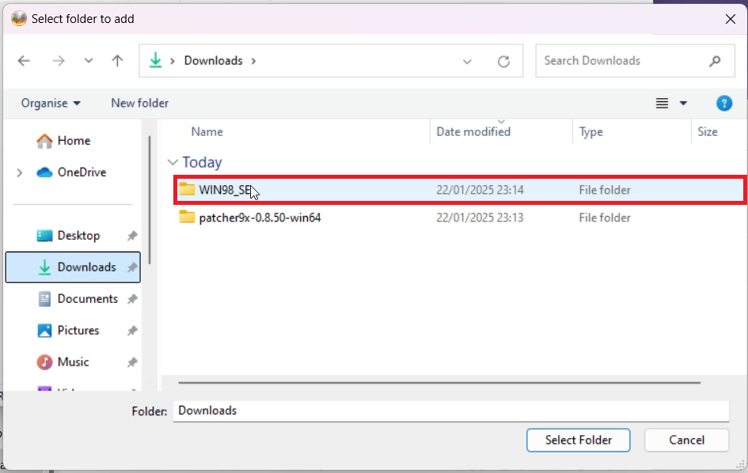

The Windows Setup will format the Virtual Drive:

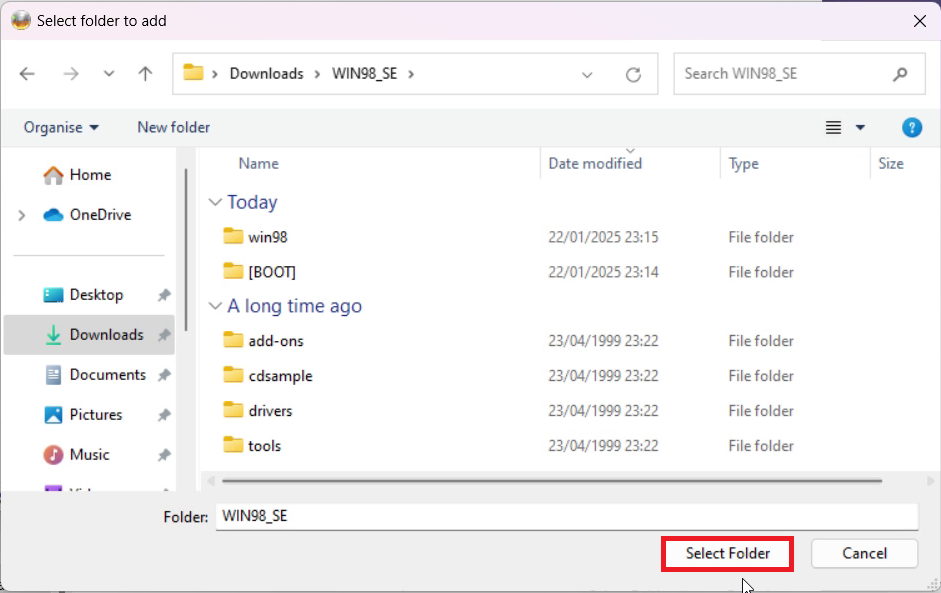

Press `↵`:


Select Continue:


Select the default `C:/Windows` and select Next:


Select Typical and press Next:


Select Install the most common components (recommended):


Use the default computer name or amend as desired and select next:


Select your location and select next:


Select next:

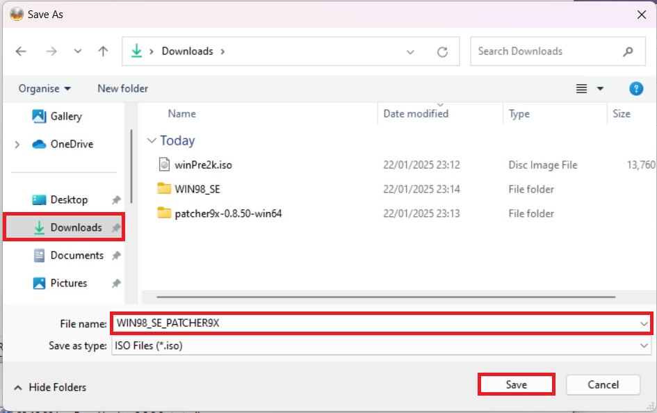

Input your user name and select next:


Accept the License Agreement and select Next:


Input the provided Product Key and select next:


Select Finish:


On a Windows 11 Host or Ubuntu 24.10 Host with a modern processor. The Windows 98SE installation errors out on a VM on a modern computer:

> This program has performed an illegal operation and will be shut down.

> If the problem persists, contact the program vendor


Essentially the processor is too fast and windows 98SE expects to wait more than "zero seconds" for an operation.

## Patcher 9x

Select Power → Shut Down Guest:


Select Yes:


Select the Windows 98 Guest and select Edit Virtual Machine Settings:


Under Hardware select Add:


Select Floppy Drive and Finish:


Select Use Floppy Drive and select the `patcher9x-0.8.50-boot.img`:


Select the Windows 98 Guest and select Play:


The Windows 98 Guest will boot to the floppy drive, select FreeDOS/XMS with CD-ROM (default):


Input:

```
patch9x
```

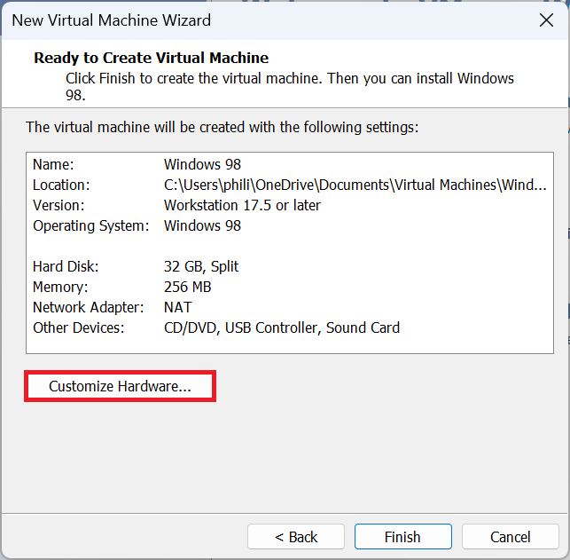

Press `↵`:


Input 

```
2
``` 

to select VMM32.VXB will be patched directly (default):


Input:

```
y
```


The Windows 98 Guest is patched press `↵` to exit:


A new DOS prompt will display:


Select Removable Devices → Floppy Settings:

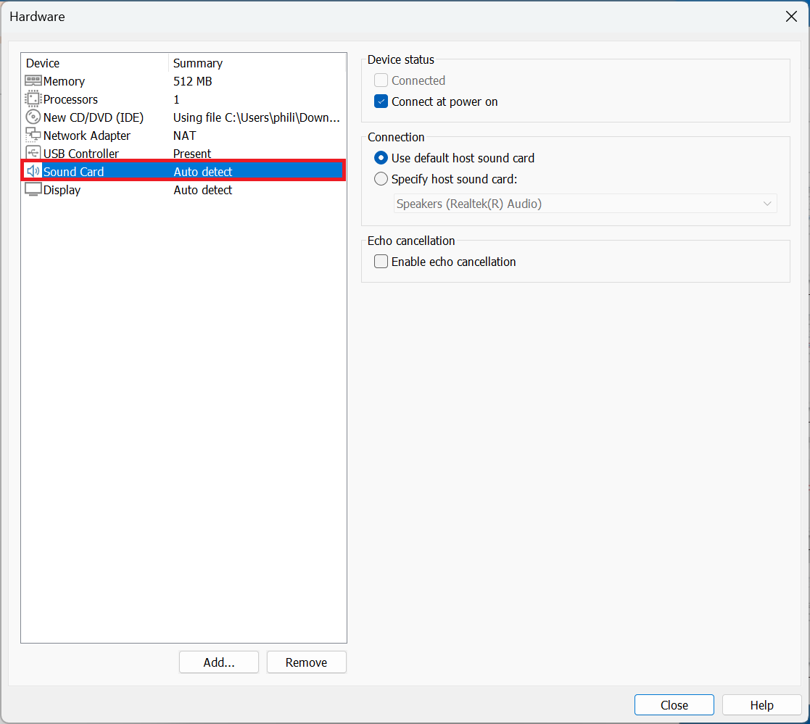

Select Floppy and uncheck Connected and Connect at Power On. Select OK:


Select Power → Restart Guest:


Select Yes:


The Windows 98 setup will proceed:


Log in:

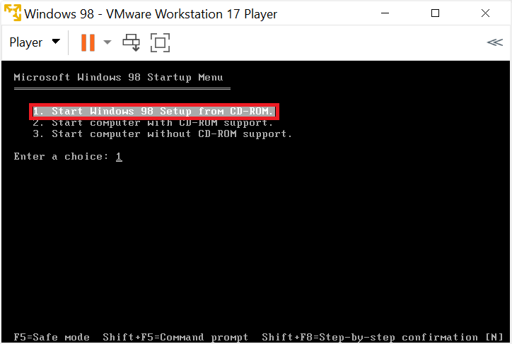

Select your Time Zone and select apply and close:


Select restart now:


Log in:


You are now on the Windows 98 Desktop:


Select Start → Shut Down:


Select Shut Down and then OK:


## Installing VMware Tools

Installing VMware tools will install some of the Windows 98 System Drivers. Installation of drivers also uses the Windows 98 Installation CD, so it is recommended to use a second virtual drive for VMware Tools.

Select the Windows 98 Guest and select Edit Virtual Machine Settings:


Under Hardware select Add:


Select CD/DVD Drive and select Finish:


Select use ISO Image and select the `winPre2k.iso`:


Select the Windows 98 Guest and select Play:


In the Windows 98 Guest, navigate to My Computer:


Select VMware Tools:


Select Next:


Select Typical (I select Complete and the same number of drivers were installed, some system drivers are missing and need to be manually installed) and Next:

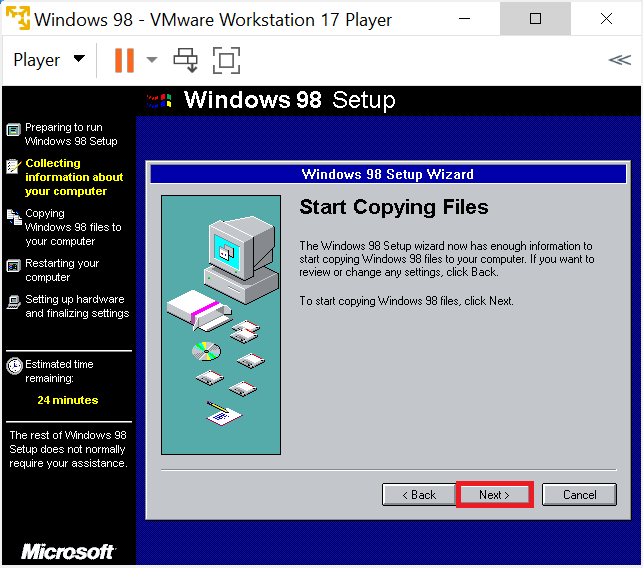

Select Install:


Select Finish:

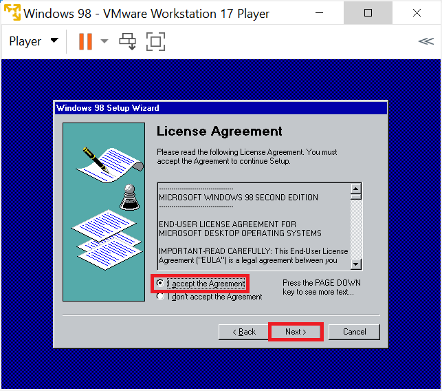

Select Yes:


The Windows 98 Guest will restart. Select My Computer:


Select Control Panel:


Select Display:


Select Settings and change the resolution to the maximum value and select apply:


Select OK:


Select Yes:


Select the Windows 98 Guest window in the Windows 11 Host or Ubuntu 24.10 Host and resize it, the Windows 98 Guest will automatically update its resolution to match the window size:


Select System:


Select Device Manager:


Notice that the:

* Multimedia Audio Device
* System Peripheral
* PCI Universal Serial Bus

do not have driver.

## Backing Up the Windows 98 Guest

Select Start → Shut Down:


Select Shut Down and then OK:


On the Windows 11 Host or Ubuntu 24.10 Host, navigate to Documents and the Virtual Machines folder:


Copy the Windows 98 folder to back it up:


This will give you a working state to revert back to if you encounter an issue during driver installation or use of the Unofficial Service Pack.

## Intel Chipset Device Software

VMware Tools is installed meaning drag and drop to the Virtual Machine works bi-directionally on a Windows 11 Host and on a Ubuntu 24.10 only from the Ubuntu 24.10 Host to the Windows 98 Guest:

Extract the `6.3.0.1007.zip` folder:


View the extracted folder and drag the `infinst_enu.exe` for the Intel Chipset Software Installation Utility to the Windows 98 Guest:


Launch the `infinst_enu.exe`:


Select next:


Select yes:


Select next:

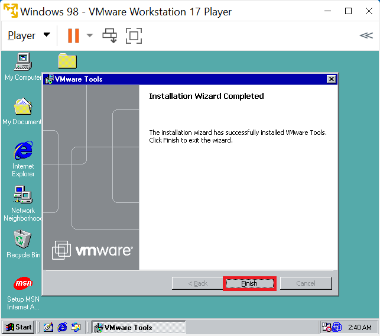

Select next to restart the Windows 98 Guest:

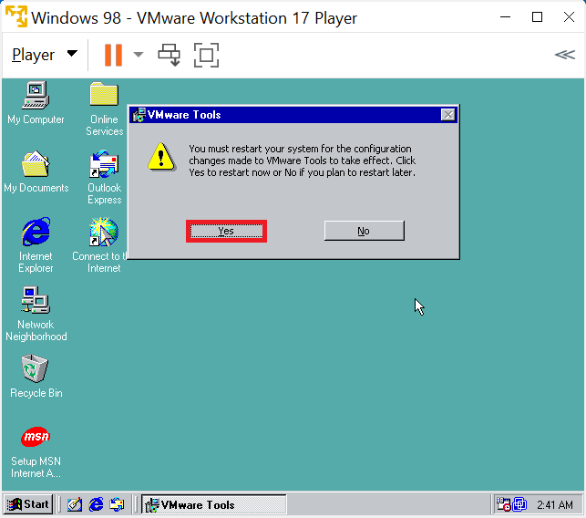

Select next:


Select next:

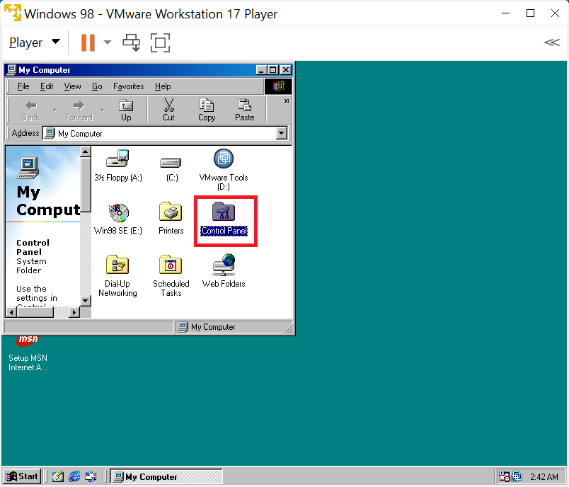

Select next:


Select next:


Select finish:

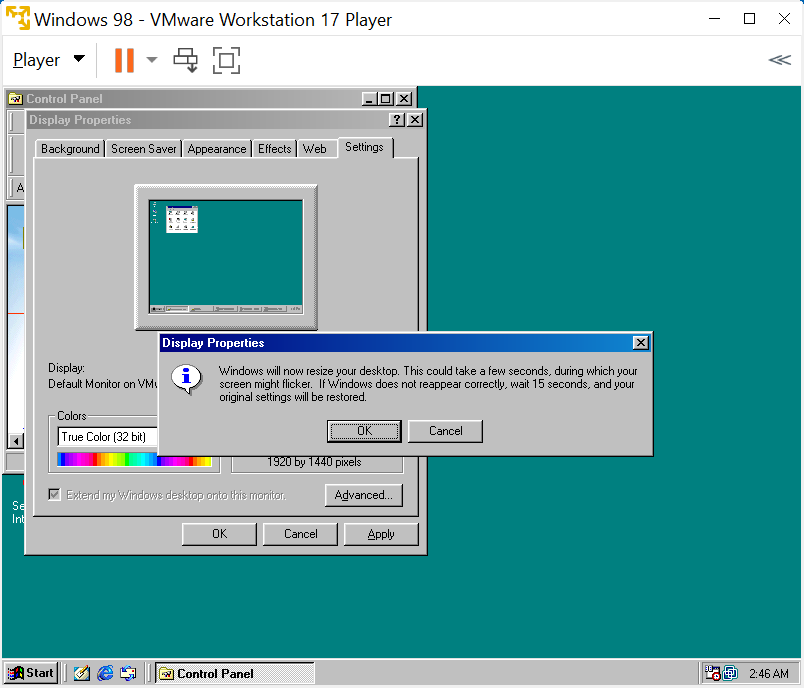

This process repeats for a number of other drivers. Select yes to restart the Windows 98 Guest:


## NUSB - USB Mass Storage

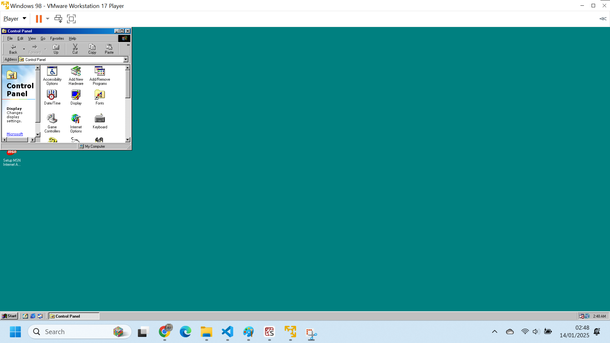


Drag driver across and install...

Update for new version...

Update in Device Manager

## Crucial Soundblaster

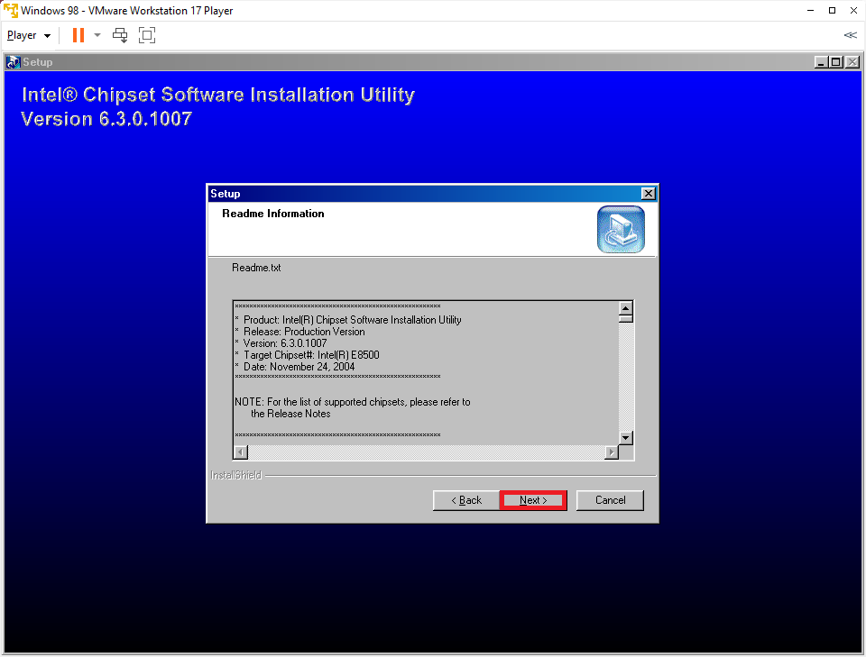


Insert Windows 98 SE Disk into D:


Launch Setup


Do the other file...


## Hardware IDs

Start Run


```
hwinfo /ui
```


```
HKEY_LOCAL_MACHINE\enum\PCI\VEN_15AD&DEV_0740&SUBSYS_074015AD&REV_10\BUS_00&DEV_07&FUNC_07
```


VMware VMCI Bus

For Windows 98 and Windows 98SE, there is no support for the VMCI device in VMware Tools. One workaround is to disable the VMCI device using the Device Manager so that it is ignored by Windows, and diagnostic tools stop reporting errors. 

https://knowledge.broadcom.com/external/article?legacyId=1023129


## Installing Unofficial Service Pack


* Install Main Updates/System Core Files

* Install latest DirectX 9C


## Drivers

https://www.conceptworks.io/en/knowledge-base/289/


* [Logitech Mouse](https://download.cnet.com/mw980enu-exe/3000-2108_4-157438.html)


https://startup.retropc.se/win98.html
