# Windows 98SE

## Windows 98SE ISO

Windows 98SE is considered abandonware and the Windows 98SE ISO and Product Key can be obtained from WinWorld:

* [WinWorld](https://winworldpc.com/product/windows-98/98-second-edition)

Use the OEM Full ISO as the Retail Full ISO doesn't boot in VMware Player and the provided product key. For this version of Windows there was only a Product Key and there was no concept of Product Activation.

## VMware Tools ISO

* [VMware Tools Pre2k](https://packages-prod.broadcom.com/tools/frozen/windows/winPre2k.iso)

## Patcher9x

The Windows 98SE installation errors out on a VM on a modern computer:

> This program has performed an illegal operation and will be shut down.

> If the problem persists, contact the program vendor


Essentially the processor is too fast and windows 98SE expects to wait more than "zero seconds" for an operation.

Download the `patcher9x.ima` from the assets of the latest release:

* [patcher9x](https://github.com/JHRobotics/patcher9x/releases/)

Right click the downloaded file and select rename: 

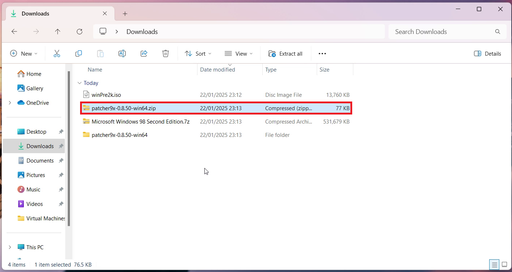

Change the file extension from `.ima` to `.img`:


Select Yes:


The virtual floppy disk is now compatible with VMware:


## Intel Chipset Installation Utility

* [6.3.0.1007](https://www.philscomputerlab.com/intel-chipset-drivers.html)

## NUSB

* [NUSB36e](https://www.philscomputerlab.com/windows-98-usb-storage-driver.html)

## Creative SoundBlaster

* [Creative SBPCI_WebDrvsV5_12_01.exe](https://support.creative.com/downloads/download.aspx?nDownloadId=1843)

* [Creative eapci8m.ecw](https://support.creative.com/downloads/download.aspx?nDownloadId=1825)

https://www.conceptworks.io/en/knowledge-base/289/

## Windows 98SE Service Pack

* [Windows 98SE Unofficial Service Pack](https://www.majorgeeks.com/files/details/unofficial_windows98_se_service_pack.html)

## Drivers


* [Direct X 9.0c](https://archive.org/details/directx9-dec2006-redist)
* [Logitech Mouse](https://download.cnet.com/mw980enu-exe/3000-2108_4-157438.html)


https://startup.retropc.se/win98.html


## Configuring the Windows 98 Guest

Select File → New Virtual Machine:


It is recommended to instead use "I Will Install this Operating System Later":


Select Microsoft Windows and Windows 98 and select Next:


The VM Name and Location will be shown. Note when used on a Windows 11 Host which is signed in with a Microsoft Account and integrated with OneDrive, the default location will be on OneDrive. The VM can be quite large and the location can be changed to local Documents by removing the OneDrive folder:


Note the name and location as these will be used later.

The default maximum size of the Windows 98 Guest is 8 GB which is a bit too restrictive. I recommend increasing this to 32 GB. Note the files on the Windows 11 Host won't be 32 GB but can be up to 32 GB if the Windows 98 Guests Virtual Drive is fully occupied with files. Windows 98 may struggle with a Virtual Drive > 32 GB:


Select Customise Hardware:


Change the memory to 512 MB (Windows 98 has issues with larger memory sizes):


Leave the processor options to their default. Windows 98 does not support any of the unticked technologies and only supports 1 processor. A modern processor may be too fast for it and the patcher9x will need to later be used to address this:

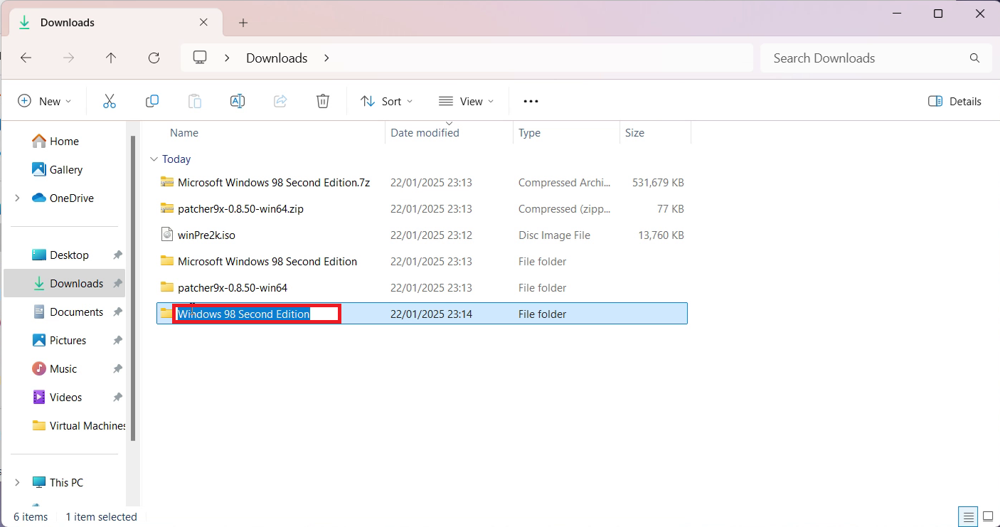

In CD/DVD select the Windows 98 SE OEM ISO:

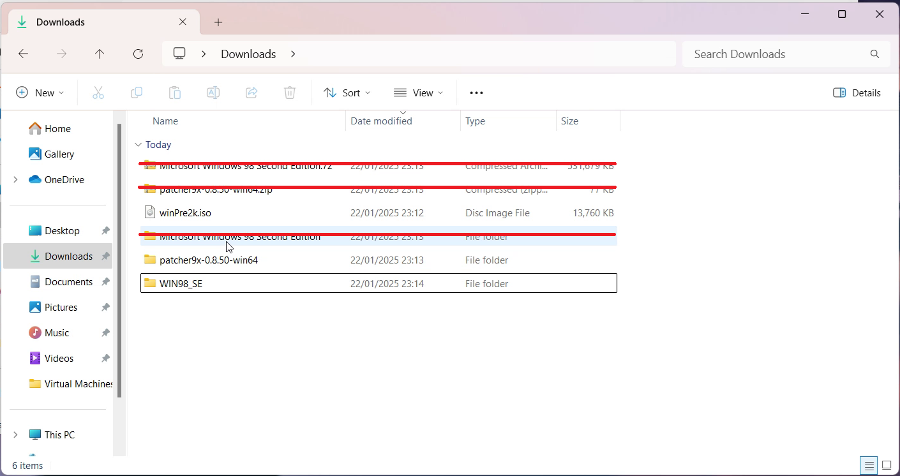

Leave Network Adaptor at the default setting:


Leave the USB Controller at the default setting. NUSB will need to be installed later to access USB Devices:


Leave the Sound Card at the default setting:


Leave display at the default setting and select Close:

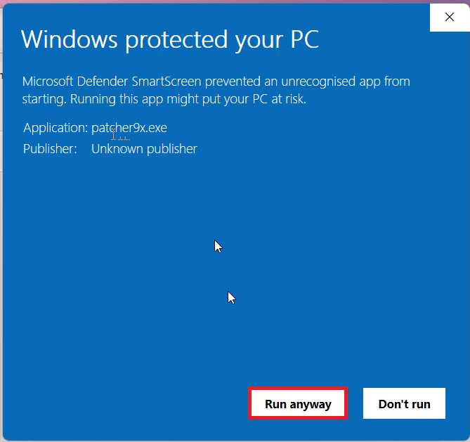

Select Finish:


## Installing the Windows 98 Guest

Select the Windows 98 Guest and select Play:


Select Boot from CD-ROM:


Select Start Windows 98 Setup from CD-ROM:


Press `↵`:


Select Configure Allocated SPace (Recommended):

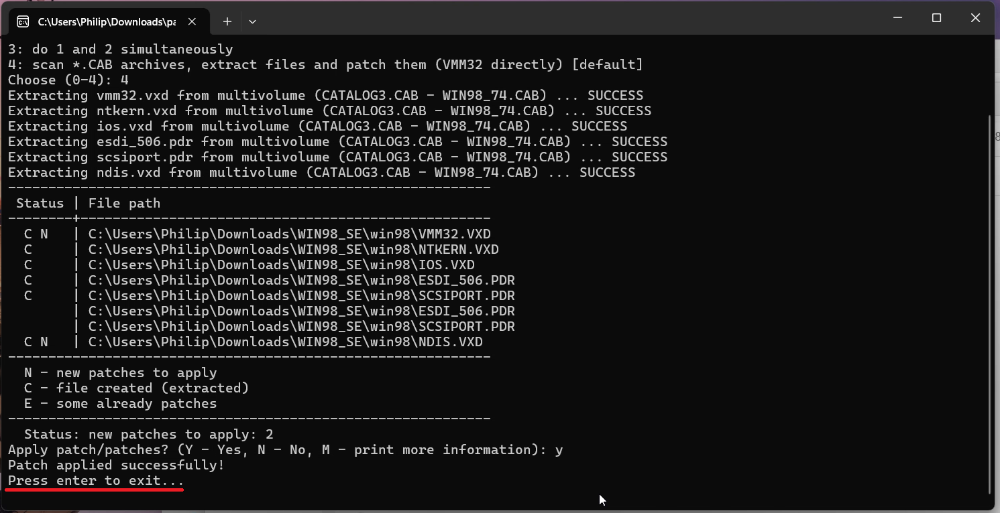

Select Yes Enable Large Disk Support:


Press `↵`:


Select Boot from CD-ROM:


Select Start Windows 98 Setup from CD-ROM:


The Windows Setup will format the Virtual Drive:


Press `↵`:


Select Continue:


Select the default `C:/Windows` and select Next:


Select Typical and press Next:


Select Install the most common components (recommended):


Use the default computer name or amend as desired and select next:

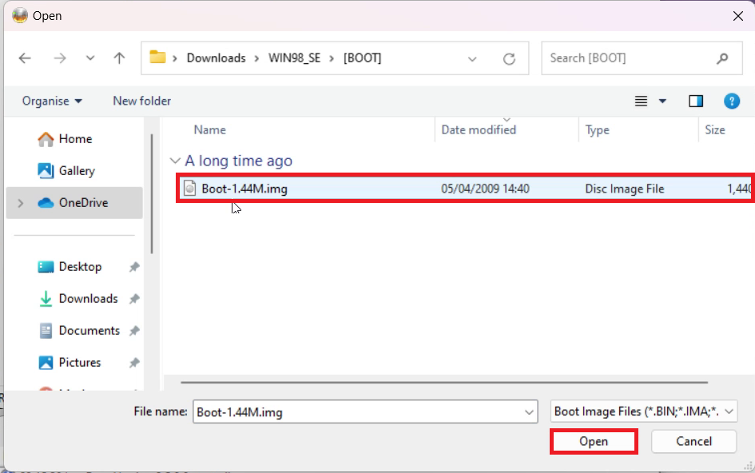

Select your location and select next:


Select next:


Input your user name and select next:


Accept the License Agreement and select Next:


Input the provided Product Key and select next:


Select Finish:

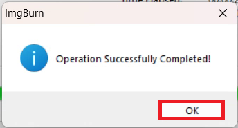

On a Windows 11 Host or Ubuntu 24.10 Host with a modern processor. The Windows 98SE installation errors out on a VM on a modern computer:

> This program has performed an illegal operation and will be shut down.

> If the problem persists, contact the program vendor

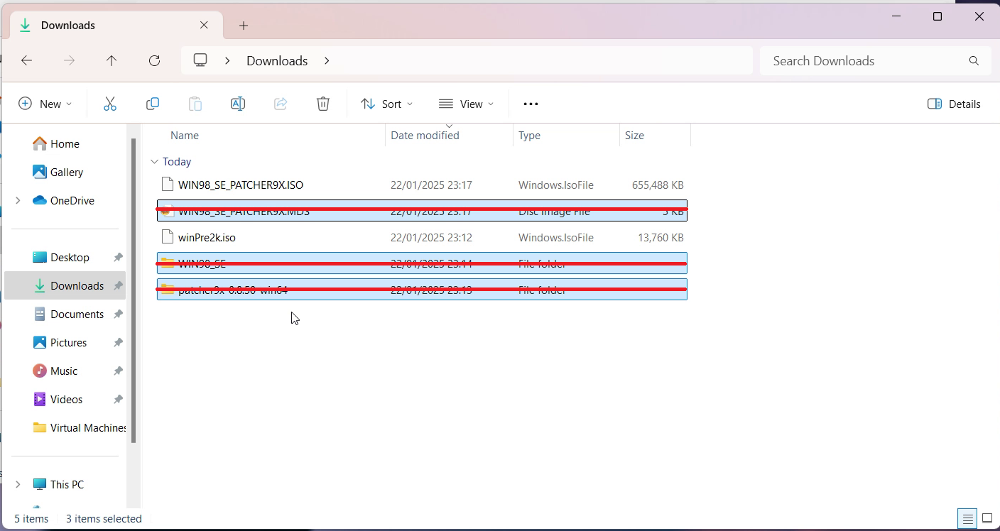

Essentially the processor is too fast and windows 98SE expects to wait more than "zero seconds" for an operation.

## Patcher 9x

Select Power → Shut Down Guest:


Select Yes:


Select the Windows 98 Guest and select Edit Virtual Machine Settings:


Under Hardware select Add:


Select Floppy Drive and Finish:

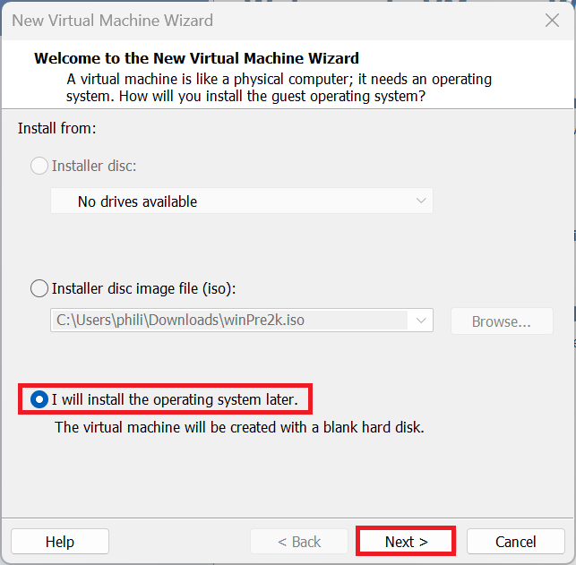

Select Use Floppy Drive and select the `patcher9x-0.8.50-boot.img`:


Select the Windows 98 Guest and select Play:


The Windows 98 Guest will boot to the floppy drive, select FreeDOS/XMS with CD-ROM (default):

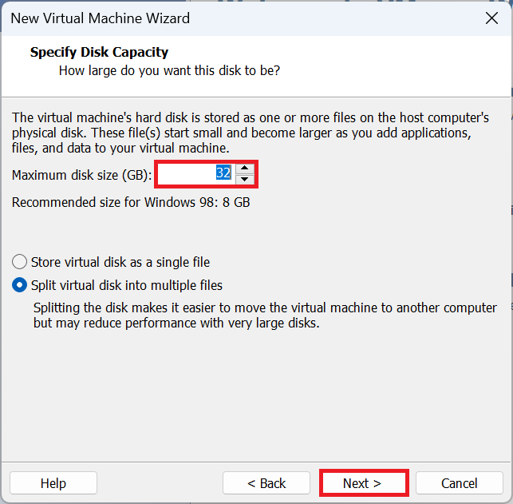

Input:

```
patch9x
```


Press `↵`:


Input 

```
2
``` 

to select VMM32.VXB will be patched directly (default):


Input:

```
y
```

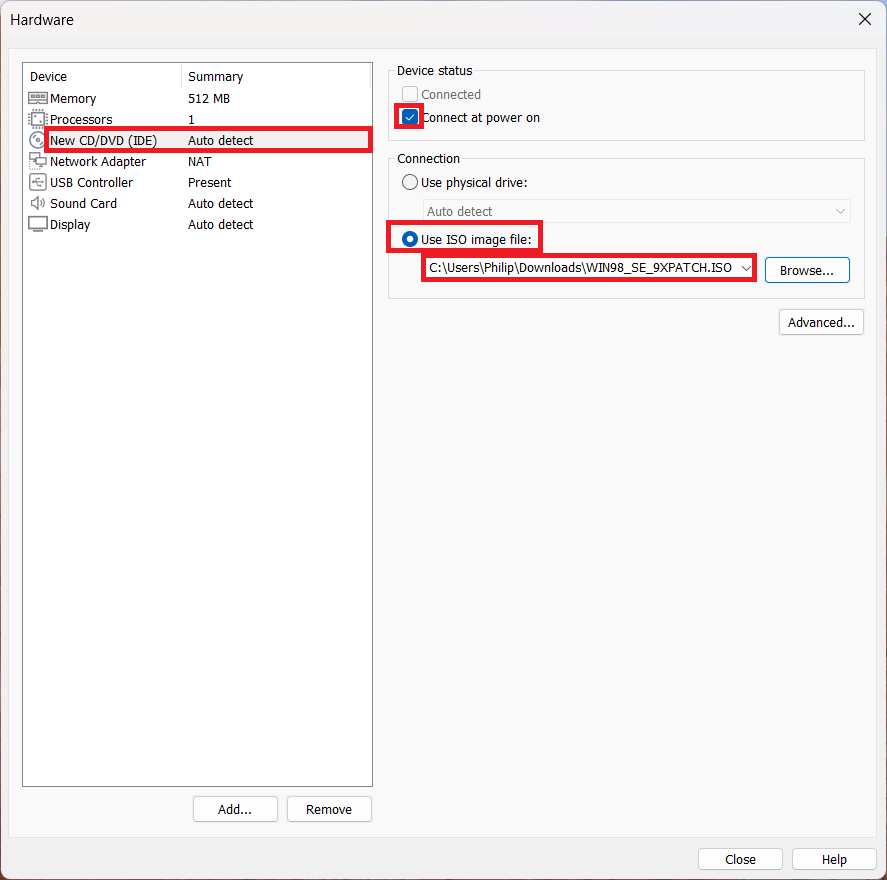


The Windows 98 Guest is patched press `↵` to exit:


A new DOS prompt will display:


Select Removable Devices → Floppy Settings:


Select Floppy and uncheck Connected and Connect at Power On. Select OK:


Select Power → Restart Guest:

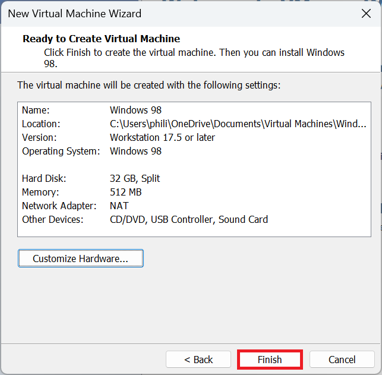

Select Yes:

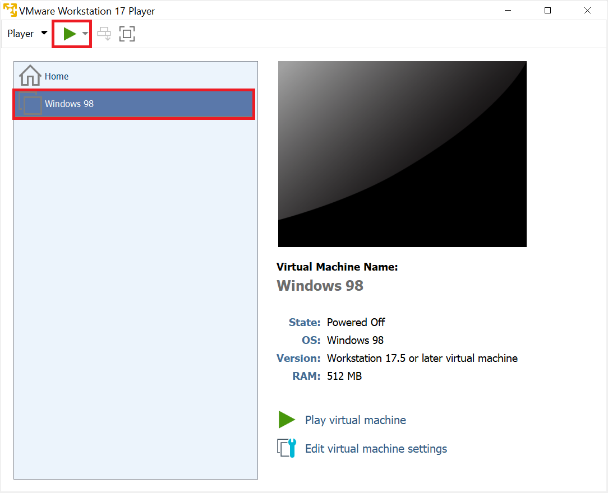

The Windows 98 setup will proceed:


Log in:


Select your Time Zone and select apply and close:


Select restart now:


Log in:


You are now on the Windows 98 Desktop:


Select Start → Shut Down:


Select Shut Down and then OK:


## Installing VMware Tools

Installing VMware tools will install some of the Windows 98 System Drivers. Installation of drivers also uses the Windows 98 Installation CD, so it is recommended to use a second virtual drive for VMware Tools.

Select the Windows 98 Guest and select Edit Virtual Machine Settings:


Under Hardware select Add:


Select CD/DVD Drive and select Finish:


Select use ISO Image and select the `winPre2k.iso`:


Select the Windows 98 Guest and select Play:


In the Windows 98 Guest, navigate to My Computer:


Select VMware Tools:


Select Next:

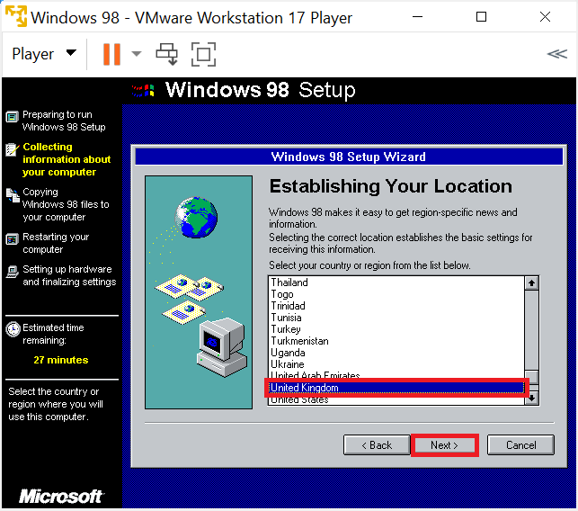

Select Typical (I select Complete and the same number of drivers were installed, some system drivers are missing and need to be manually installed) and Next:


Select Install:

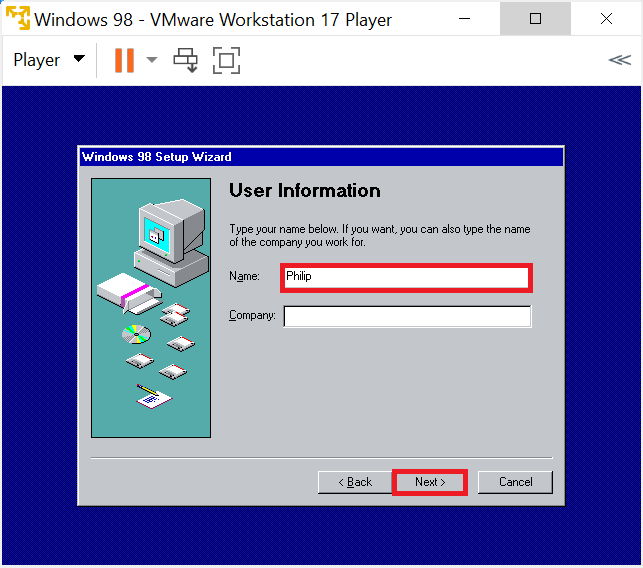

Select Finish:


Select Yes:


The Windows 98 Guest will restart. Select My Computer:


Select Control Panel:


Select Display:


Select Settings and change the resolution to the maximum value and select apply:


Select OK:


Select Yes:


Select the Windows 98 Guest window in the Windows 11 Host or Ubuntu 24.10 Host and resize it, the Windows 98 Guest will automatically update its resolution to match the window size:


Select System:


Select Device Manager:


Notice that the:

* Multimedia Audio Device
* System Peripheral
* PCI Universal Serial Bus

do not have driver.

## Backing Up the Windows 98 Guest

Select Start → Shut Down:

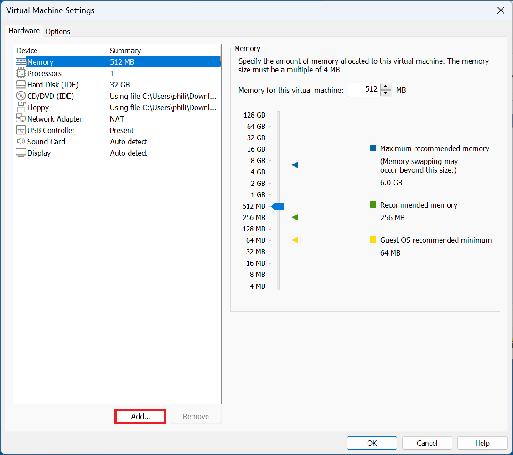

Select Shut Down and then OK:

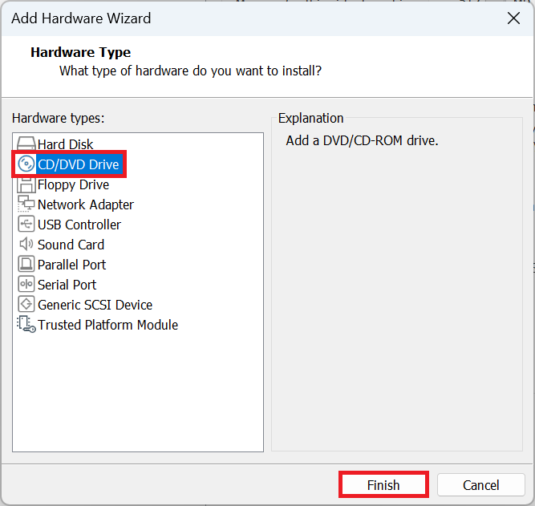

On the Windows 11 Host or Ubuntu 24.10 Host, navigate to Documents and the Virtual Machines folder:


Copy the Windows 98 folder to back it up:


This will give you a working state to revert back to if you encounter an issue during driver installation or use of the Unofficial Service Pack.

## Intel Chipset Device Software

VMware Tools is installed meaning drag and drop to the Virtual Machine works bi-directionally on a Windows 11 Host and on a Ubuntu 24.10 only from the Ubuntu 24.10 Host to the Windows 98 Guest.

Update for new version...

Drag the `setup.exe` for the Intel Chipset Software Installation Utility to the Windows 98 Guest:


## NUSB - USB Mass Storage

Drag driver across and install...

Update for new version...

Update in Device Manager

## Crucial Soundblaster


Insert Windows 98 SE Disk into D:


Launch Setup


Do the other file...


## Hardware IDs

Start Run


```
hwinfo /ui
```


```
HKEY_LOCAL_MACHINE\enum\PCI\VEN_15AD&DEV_0740&SUBSYS_074015AD&REV_10\BUS_00&DEV_07&FUNC_07
```


VMware VMCI Bus

For Windows 98 and Windows 98SE, there is no support for the VMCI device in VMware Tools. One workaround is to disable the VMCI device using the Device Manager so that it is ignored by Windows, and diagnostic tools stop reporting errors. 

https://knowledge.broadcom.com/external/article?legacyId=1023129


## Installing Unofficial Service Pack


Install Main Updates/System Core Files


Installation of the Unofficial Service Pack
The unofficial service pack can be downloaded from Softpedia:
http://www.softpedia.com/get/System/OS-Enhancements/Unofficial-Windows-SE-Service-Pack.shtml
It is unfortunately only available as a .exe and not a .iso files so can't be loaded to the VM until its part of a .iso:

I use ImgBurn to make it a .iso. Be careful with installation of ImgBurn as it preinstalls some junk if you don't opt to install only ImgBurn see my instructions here. Once ImgBurn is installed launch it:

Select create image file from files/folders:

Select to browse for a file:

Select the unofficial service pack then select open:

Select the folders to image button:

Select a location for the .iso and select save:

Change the volume label and then select yes:

You will be told the .iso is made:

Select ok and then close ImgBurn:

Now select the player menu → Removable Devices → CD-DVD Drive → Settings:

Select Browse and load the .iso you just created with the Unofficial Service Pack Update:

Select the .iso and select open:

Select ok:

This annoying error message comes up just select yes (whenever you see it after changing CD-DVD .iso):

Go to computer:

Open the .iso:

Launch the unofficial Service Pack:

Select yes:

I advise selecting most the options however I unchecked the new boot and shut down logos. When ready select ok:

Select ok and then yes:

You will see the Windows 98SEshutting down screen, VMWare virtual BIOS and then the Windows 98SE Starting screen:

You will be prompted to login. If you have set a password input it and then select ok:

It will continue to install:

You'll reach the Windows 98SE Desktop:

Installation of VMWare Tools
In order to get a decent resolution (video) and be able to drag and drop files over to the VM you will need to install VMWare tools. Select player → manage → install VMWare Tools:

This will load the VMWare Tools .iso in the optical drive. Select yes at the annoying error message.

The VMWare tools installation should autorun if not go to computer and launch it from the optical drive.

Select next:

Select typical and then next:

Select install:

Select okay, yes and ok for the annoying error messages (again to do with the virtual optical drive):

Select Finish:

Select yes to restart:

You will see the Windows is shutting down screen, the VMWare BIOS and the Windows is starting screen:  
Input your password if you've set one and select ok:

To get a decent resolution, right click the desktop and select properties:

Select settings:

Maximise the resolution and then select apply and then ok, then yes:

 
The resolution will be too much. Left click the top of the VMWare Window in the host. Hold down the left click and drag the Window around.

It will then get smaller. Then just snap it to the top again:

The resolution of the VM should now resize automatically to fit the VM Window within the host machine.

Installation of Missing Drivers
Although VMWare tools installs the display driver and allows bidirectional drag and drop it is missing some of the drivers in particular the audio. Looking at the device manager gives 3 unknown devices. Go to start → settings → Control Panel:

Select System:

The main missing device is the audio:

As far as I can tell there are not any system drivers for the 2 additional devices and they are not necessary for the function of the VM. If someone has installed drivers let me know so I can update the guide.
Download the following on your host PC.
Intel Chipset
http://downloadcenter.intel.com/Detail_Desc.aspx?agr=Y&DwnldID=8178&ProdId=816&lang=eng
Intel USB 2.0:
http://downloadcenter.intel.com/Detail_Desc.aspx?agr=Y&DwnldID=5829&ProdId=950&lang=eng
NUSB:
http://www.mdgx.com/spx/NUSB.EXE
Creative Sound Driver:
http://ccftp.creative.com/manualdn/Drivers/Others/1843/SBPCI_WebDrvsV5_12_01.exe
Direct X 9.0c:
http://www.oldapps.com/directx.php?system=Windows_98
Logitech Mouse
http://affiliates.digitalriver.com/z/140280/CD133407/ihgvhd38gd010nwu00jmo&lnkurl=http://www.logitech.com/pub/techsupport/mouse/mw980enu.exe
With VMWare tools you can drag and drop files from the host to the VM or vice versa from folder to folder or folder to desktop. Dragging all these updates across:
 
As some of these drivers will refer to the Windows 98SE installation CD so its best to load the Windows 98 SE .iso. Go to player → Removable Devices → CD/DVD and then settings:

Browse for the Windows 98SE .iso:

Load the .iso:

Select yes at the annoying warnings:

Close the Windows 98SE setup if automatically runs:

Installing the drivers is fairly straightforward but some additional notes.
Intel Chipset - The find new hardware wizard will show select Next, Check Search for the best driver for your device then select Next. Check Specify a Location and the default as C:\Windows\CATROOT and then select next. Repeat several times.
Creative Sound Driver - Wait for al the New Hardware Found Windows to show and disappear before restarting.
Direct X 9.0c - Make a folder on the Desktop and extract the files to it. In the folder launch the DirectX Setup.
Logitech Mouse - Install this and then configure your mouse cursor to suit a speed you are comfortable with.
Addition of Legacy Devices
You can add more hardware such as a floppy drive (virtual floppy drive with .flp images or an onboard/USB floppy drive), serial port (onboard or USB serial port) and parallel port (onboard or USB serial port). Power off the VM and right click your VM and select settings:

Select Add Hardware:

Select yes at the User Account Control:

You may add a floppy drive, parallel port and/or serial port depending on the legacy hardware you wish to connect to:

I advise not setting the Floppy to Connect at Power on otherwise the system will try to boot from the Floppy Disk before the HDD> This can be amended in the BIOS setup however:

 

These and USB devices can be accessed via the Player Menu. Each optical drive, floppy drive, network adapter, serial port, parallel port and soundcard will be listed separately. Below these any USB device are listed. If the USB devices have a tick they are connected to the VM (and removed from the Host OS). The Ability to connect to all of these Removable Devices and the installation of legacy Windows OS make the VM very powerful: