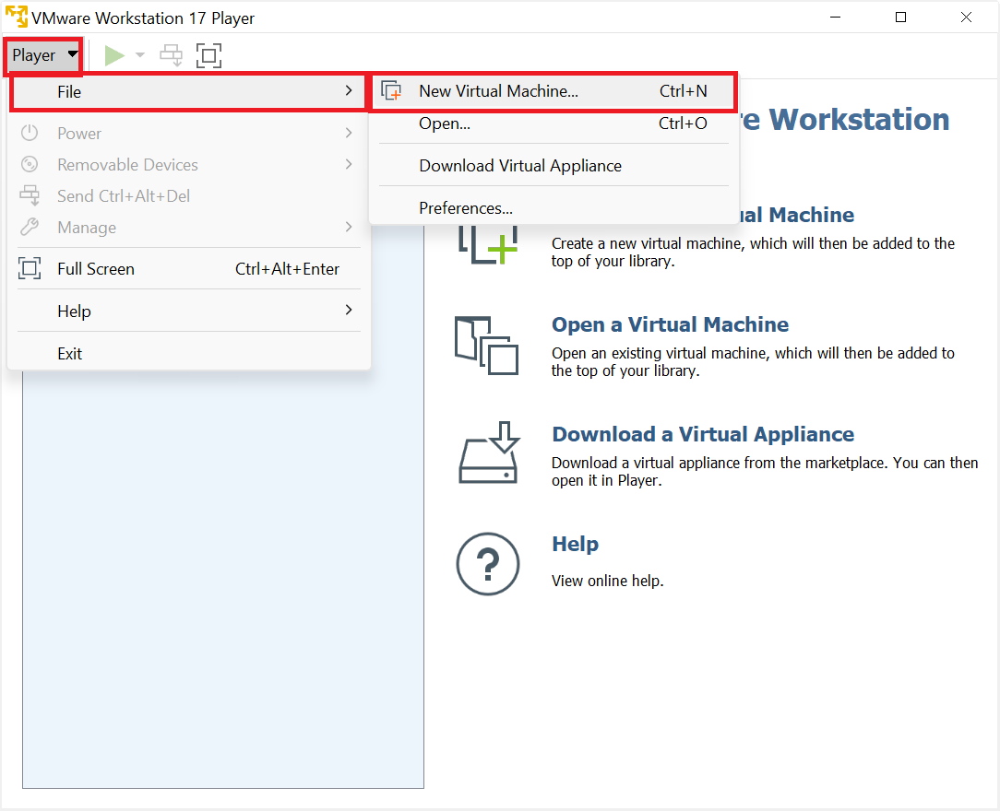
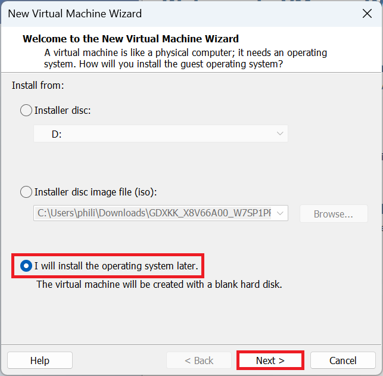
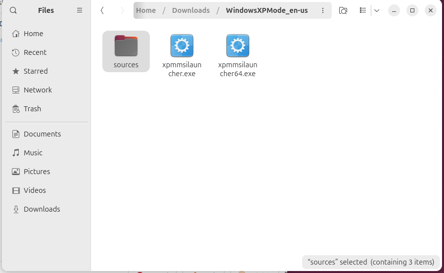
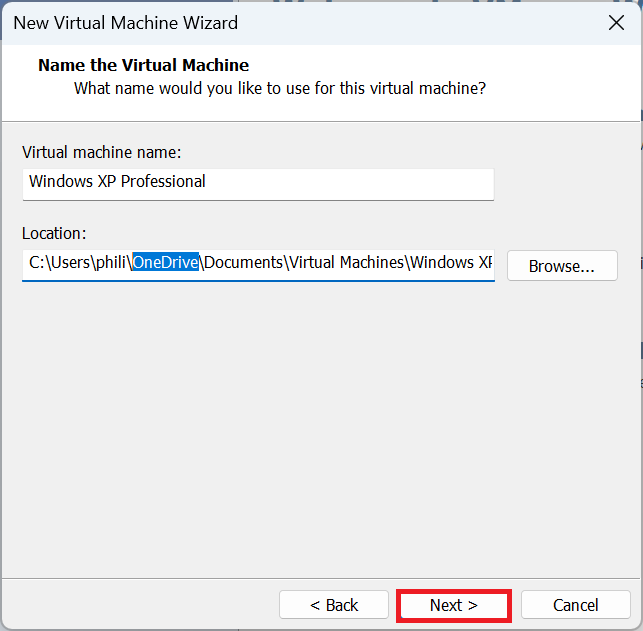
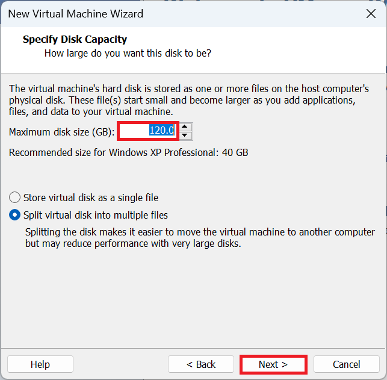
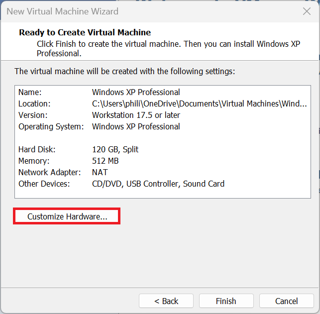
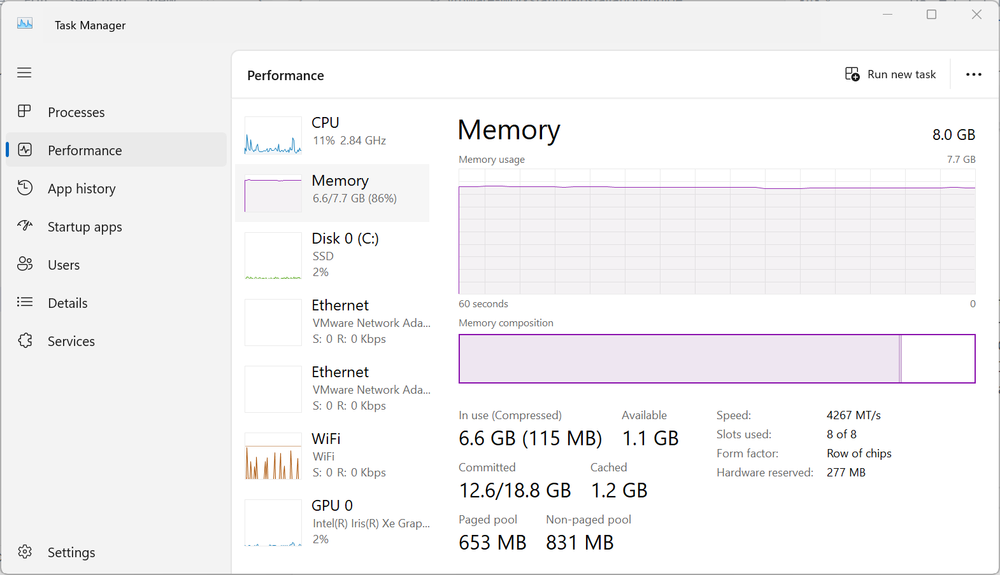

# Windows XP

Setting up a Windows XP Guest using VMware Workstation Player.

## Installation Media

The biggest difficulty to setting up a Windows XP VM is obtaining the installation as Microsoft nor its OEMs provided official download links.

### Windows XP Windows Volume License Installation ISO

The Windows XP Professional SP3 Volume License ISO and associated Product Key is not yet available to download on WinWorld:

* [WinWorld Placeholder: Windows XP ISO and Product Key](https://winworldpc.com/product/windows-xp/final) 

Which otherwise lists abandoned Windows Versions from Windows 1 through to Windows ME. 

The Windows XP Professional SP3 Volume License ISO was used for large organisations such as Universities, Governments and Enterprise companies and is preferred for a Windows XP Professional VM as it activates offline and does not have the hassles of Microsoft Product Activation.

  
Unofficial Links (Untested)

Unofficially a copy of the Volume License ISO appears to be listed here:

* [Archive Org Microsoft Windows XP SP3 Reinstallation ISO](https://archive.org/details/win-xp-pro-sp-3-x-86)

Unofficially Volume License Keys are listed on this GitHub repository:

* [GitHub: Windows XP All Keys Universal Product Key Collection All Keys](https://github.com/Fuwn/xp)

### Dell Windows XP OEM Reinstallation ISO

OEM SLP activation is not carried out by default when using a Windows XP Virtual Machine as the Virtual Machine lacks the SLIC 1.0, SLIC 2.0 (Windows Vista Business Edition to Windows XP Professional Downgrade Rights) or SLIC 2.1 (Windows 7 Professional Downgrade Rights to Windows XP Professional Downgrade Rights) in the Virtual BIOS by default. This will result in a 30 Day Trial.

  
30 Day Trial...

Windows XP has an initial 30 day grace period. After this grace period you are forcefully logged out and can only login to activate.

  
Unofficial Links (Untested)

Unofficially a copy of the Dell Windows XP SP3 Reinstallation ISO appears to be listed here:

* [Archive Org Dell Windows XP SP3 Reinstallation ISO](https://archive.org/details/dell.-xp-pro-sp-3)

### Windows XP Mode Notes (Not Recommended)

A common question is conversion of the Windows XP Mode VM into a VMware Workstation VM:

* [Windows XP Mode](https://download.cnet.com/windows-xp-mode/3000-18513_4-77683344.html)

A VM can be created from this by renaming the file `WindowsXPMode_en-us.exe` to `WindowsXPMode_en-us.zip`. Then extracting the zip file and going to the sources folder. Then renaming the `xpm` to `xpm.zip` and renaming the `VirtualXPVHD` to `VirtualXP.VHD`. The `VirtualXP.VHD` can be used as a Virtual Drive in VMware Workstation Player but results in a VM where the mouse doesn't work. Installation of VMware tools gives a black screen.

## VMware Tools ISO

The Windows XP drivers for the Windows XP Guest are contained in the VMware Tools Installation ISO. VMware tools for legacy versions of Windows needs to be downloaded from VMware separately:

* [VMware Tools Version 10.0.12 ISO](https://packages.vmware.com/tools/releases/10.0.12/windows/)

## Windows 11 Host or Ubuntu 24.10 Host System Requirements

Your Windows 11 Host PC or Ubuntu Host PC should satisfy the minimum system the system requirements of Windows 11 and have additional overhead to run a Virtual Machine in addition to these requirements. It is recommended to have a Host PC with at least:

* i5 or i7 11th Generation Intel Processor or Newer
* 16 GB RAM
* 1 TB SSD

## Configuring Virtual Hardware for a Windows XP Guest

Select File → New Virtual Machine:

It is recommended to instead use "I Will Install this Operating System Later":

Select Microsoft Windows and Windows XP Professional and select Next:

The VM Name and Location will be shown. Note when used on a Windows 11 Host which is signed in with a Microsoft Account and integrated with OneDrive, the default location will be on OneDrive. The VM can be quite large and the location can be changed to local Documents by removing the OneDrive folder:

Note the name and location as these will be used later.

The default maximum size of the Windows XP Guest is 40 GB which is a bit too restrictive. I recommend increasing this to 120 GB. Note the files on the Windows 11 Host won't be 120 GB but can be up to 120 GB if the Windows XP Guests Virtual Drive is fully occupied with files:

Select Customise Hardware:

The default memory used by the Windows XP Guest is 512 MB (0.5 GB). If the Windows 11 Host PC has ≥32 GB RAM, this can be upped to 4096 MB (4 GB) for increased performance in the Windows XP Guest, if the Windows 11 Host PC has ≤16 GB of RAM, setting this to 4096 MB (4 GB) may throttle the Host PC leading to an overall decreased performance so use 2048 MB (2 GB). The task manager can be opened in the Windows 11 Host PC to view the installed memory (RAM):

