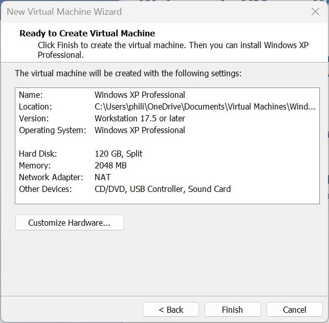
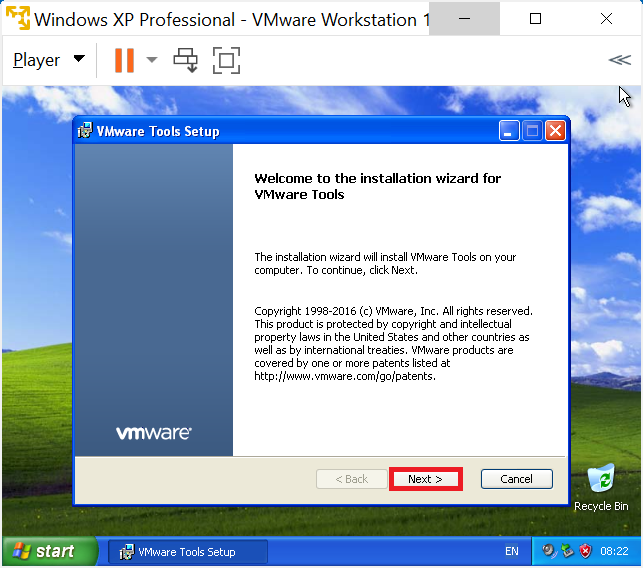
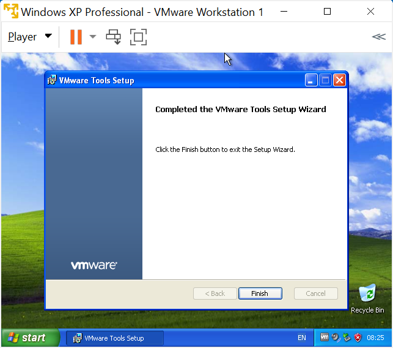
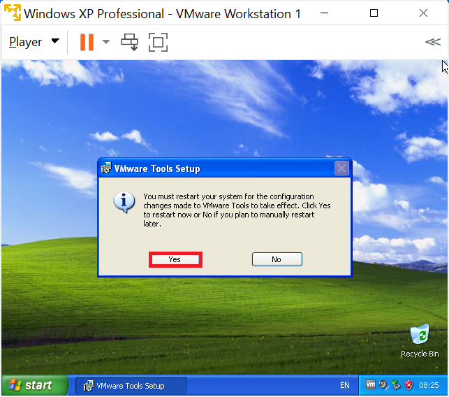

# Windows XP

Step-by-step guides for VMware Workstation 17.6.4, focused on running Windows XP in a virtual environments. Learn to enable shared folders, USB passthrough and serial port passthrough to control legacy scientific instruments and laboratory hardware, making older software and devices compatible with modern systems. Windows XP has widespread legacy use as many scientific instruments from the late 1990s to late 2000s shipped with Windows XP drivers only. Ideal for university researchers, lab technicians, and IT staff supporting legacy lab equipment. Windows XP reached its official end of life in April 2014, meaning Microsoft no longer provides security updates, bug fixes, or technical support for this operating system. Activation servers have also been retired, so installations can only proceed with generic OEM SLP keys. 

## YouTube Video

* [YouTube](https://www.youtube.com/watch?v=UCgV4CsyyIE)

## Notes

VMware Workstation Player 17.6.4 has Windows XP as an option for a Virtual Machine. However Windows XP is regarded as a legacy Operating System and isn't tested by Broadcom. Moreover the VMware Tools 12.5.3 which comes with VMware workstation player doesn't support Windows XP and the following errors will display if they are attempted to be installed in the Windows XP VM:

VMware Tools 10.0.12 is the last version of VMware Tools to support Windows XP and should be downloaded seperately as an ISO. This ISO should be mounted in the VM so they can be installed manually.

On modern hardware, with a 11th-14th Generation Processor, the following entries should be added to the VMX file:

```
monitor.virtual_exec = "hardware"
monitor.virtual_mmu = "software"
mks.enableVulkanRenderer = "FALSE"
cpuid.0.eax = "0000000X"
cpuid.1.ecx = "00000001"
```

The first setting allows the CPU to optimise the VM performance, the VM may be very slow without this setting. The second setting prevents use of a memory management unit that Windows XP doesn't understand and can lead to a Blue Screen of Death (BSOD). The third setting prevents VMware from using Vulkan for rendering, which isn't supported by Windows XP and often leads to black screens. The last two settings prevent Windows XP from seeing unsupported CPU features which Windows XP doesn't understand and can lead to a Blue Screen of Death (BSOD).

## Installation Media

The biggest difficulty to setting up a Windows XP Virtual Machine is obtaining the installation as Microsoft nor its OEMs provided official download links. WinWorld hasn't been updated to include Windows XP:

* [WinWorld Placeholder: Windows XP ISO and Product Key](https://winworldpc.com/product/windows-xp/final) 

<details>
  <summary>Archive.org</summary>

The Website Archive.org hosts each Unofficial Dell Windows XP Reinstallation ISO:

* [Dell Windows XP SP3 Professional Reinstallation ISO](https://archive.org/details/dell.-xp-pro-sp-3)
* [Dell Windows XP SP2 Home Reinstallation ISO](https://archive.org/details/dell-xp-home-sp-2)
* [Dell Windows XP SP2 Media Center Reinstallation ISO](https://archive.org/details/xp-mce-sp-2)

The ISO Checksums can be used to ensure a complete download but these do not match official Dell or Microsoft records as they would have been created from a CD/DVD by an end user:

|ISO|sha256 ISO Checksum|
|---|---|
|XP Pro|a4cf4e53ac9157cf20913a77f438a64e4fa3b908e4e28cb0d2a08d49fa62e49f|
|XP Home|aa0629a1d076c835b49b4b4e97d6f7717813d051cfbeba8d9d69ee6d8f6e8866|
|XP MCE|293a5f6424888f78865e78f33dfd0714bbe54e61dcf27c9c16cacfa08eb4fa0a|

</details>

### Creating a Installation ISO from a CD

Dell Systems came with a Windows XP Reinstallation CD/DVD which can be converted into an ISO using nLite:

* [Using nLite to Create a Windows XP Installation ISO from a Dell Windows Reinstallation CD/DVD](./integration/readme.md)

### WSUS Offline Update

The Website Archive.org hosts the ISO created from WSUS Offline Update before Microsoft removed Windows XP downloads from their download servers:

* [WSUS Offline Update Windows XP (Windows XP 32 Bit=wxp-enu)](https://archive.org/details/wsusoffline-eol-windows)

</details>

### VMware Tools ISO

The Windows XP drivers for the Windows XP Guest are contained in the VMware Tools Installation ISO. The Website Archive.org appears to host the ISO created by VMware before Broadcom removed it:

* [VMware Tools Version 10.0.12 ISO](https://archive.org/details/vmware_tools_pre_vista)

## Windows 11 Host or Ubuntu 24.10 Host System Requirements

Your Windows 11 Host PC or Ubuntu Host PC should satisfy the minimum system the system requirements of Windows 11 and have additional overhead to run a Virtual Machine in addition to these requirements. It is recommended to have a Host PC with at least:

* i5 or i7 11th Generation Intel Processor or Newer
* 16 GB RAM
* 1 TB SSD

## Configuring Virtual Hardware for a Windows XP Guest

Select Player → File → New Virtual machine...


It is recommended to instead use "I Will Install this Operating System Later":


Select Microsoft Windows and Windows XP Professional and select Next:


Use the default Virtual Machine Name and Location (if Documents is integrated with OneDrive, you may want to move this to a local only location) and select next:


The default maximum size of the Windows XP Guest is 40 GB which is too small, I recommend increasing this to 120 GB. Note the files on the Windows 11 Host won't be 120 GB but can be up to 120 GB if the Windows XP Guests Virtual Drive is fully occupied with files:


Select Customise Hardware:


The default memory used by the Windows XP Guest is 512 MB (0.5 GB). If the Windows 11 Host PC has ≥16 GB RAM, this can be upped to 4096 MB (4 GB) for increased performance of the VM. Note if the Windows 11 Host PC has ≤8 GB of RAM, setting the RAM to 4096 MB (4 GB) may throttle the Host PC leading to decreased performance and 2048 MB (2 GB) may be more approprate:


The default number of processors cores used by the Windows XP Guest is 1. This can be upped to 2 if the Windows 11 Host has a processor with ≥ 16 cores. If the Windows 11 Host PC has ≤16 cores, setting this to a higher value may throttle the Host PC leading to an decreased performance:


Under CD/DVD select browse:


Load the Dell Windows XP Reinstallation ISO or Windows XP Volume License Installation iSO:


Ensure connected at power on is enabled:


Uncheck Connect at Power On for Network Adaptor:


The default USB Controller for Windows XP is USB 2.0 and Windows XP does not have any drivers for USB 3.0:


The default Sound Card can be used for the Windows XP Guest:


The default Display can be used for the Windows XP Guest:


Select Close and Finish.



## Windows XP Guest Virtual Machine Configuration File

Navigate to the directory on the Windows 11 Host that the Windows XP Guest is installed: 


Look for the `Windows XP.vmx` file:


Open in Notepad or Notepad++ (recommended):


Press `Ctrl+f` to begin a search for an option for example `bios.bootDelay`:


If the line exists it can be modified to a new value. In this case it doesn't exist so can be appended to the end:

```
bios.bootDelay = "20000"
```


The command above will change the time the Windows XP Guest Virtual BIOS displays before selecting the default boot option giving more time to select the option to boot from CD/DVD. This line can be removed post-installation.

### Modern Generation Processors (11-14th Generation)

Certain legacy settings may need to be configured to run older guest operating systems such as Windows XP.


Legacy CPU settings:

```
cpuid.0.eax = "0000000X"
cpuid.1.ecx = "00000001"
```

These settings help emulate older CPU instructions that XP expects.

Legacy monitor / virtualization settings

```
mks.enableVulkanRenderer = "FALSE"
```

This disables the Vulkan renderer, forcing VMware to use a more compatible DirectX/software renderer.

Legacy monitor / virtualization settings:

```
monitor.virtual_exec = "hardware"
monitor.virtual_mmu = "software"
```

These settings ensure proper CPU and MMU handling for legacy guests.

### OEM SLP

OEM SLP is not applied by default:

<details>
  <summary>Modded ROMs</summary>

The my digital life forums has a post about a modded Virtual BIOS which includes a Dell SLIC 1.0 compatible with Dell Windows XP Professional OEM SLP. These ROMs are not supported by Microsoft or Dell (but then neither is Windows XP). You will need to log into their forums to view the files:

* [My Digital Life: SLIC 1.0, 2.1 Mod](https://forums.mydigitallife.net/threads/vmware-workstation-esxi-bios-efi-slic-mod.64693/#post-1132133)

Extract the downloaded file and navigate to the `17.6.0 Modded ROMs` folder. Rename `WORKSTATION_17.6.0_DELL2.7_SLIC_BIOS.440_(497).ROM` to `modded_BIOS.440.ROM` and copy the modded ROM to the directory of the Windows XP Guest. Update the Virtual Machine Configuration file to:

```
bios440.filename = "modded_BIOS.440.ROM"
```

Note if the corresponding ROM is not found in the directory the above line of code will prevent the Windows XP Guest from booting.

</details>

## Installing the Windows XP Guest OS

Select the Windows XP Guest and select Play:


The WIndows XP Setup will begin:


Press `↵` to continue:


Press `F8` to proceed:


Press `↵` to install Windows XP on the unpartitioned space:


Select Format the System using NTFS (quick):


Select Customise and change the Regional Settings, Location and Keyboard Settings:


Select Next:


Input your User Name and select Next:


Input the computer name and select Next:


Select the Time Zone and select Next:


Select Typical Settings:


Select No, leaving WORKGROUP as the default and then next:


Select OK:


Select OK:


You will be taken to the Windows XP Desktop:


Select the red warning in the system tray, then select Change the way Security Centre Alerts Me:


Uncheck the three boxes:


## Installing Windows SP3 and Post-SP3 Updates

Select Player → Manage → CD/DVD and select Settings:


Select browse:


Select `wsusoffline-wxp-enu.iso`:


Select ok:


Select My Computer:


Right click the D: drive and select explore:


Select UpdateInstaller:


Select the following options:


Updates will install and the VM will reboot multiple times:


When finished, the following will display no missing updates found. Nothing to do!


## Installing VMware Tools

Select Player → Removable Devices → CD/DVD → Settings:


Select browse:


Select the `winPreVista.iso` and select open:


Windows XP has autoplay enabled by default and the VMware Tools installation should begin. If it does not go to Computer in the Windows XP Guest and start the setup from the CD/DVD:



Select Next:


Select Next:


Select Install:



Select Yes to restart:



The Windows XP Guest will restart and the window in the Windows 11 Host can now be resized, resizing the Windows XP Guest:


On a Windows 11 Host, drag and drop to the Windows XP Guest is bi-directional. On a Ubuntu Host, drag and drop from the Ubuntu Host to the Windows XP Guest works but does not work from the Windows XP Guest to Ubuntu Host (Shared Folders can be configured for that). The Standalone Windows XP Service Pack 4 Update can be copied to the Windows XP Guest:


## Windows Product Activation Timer

The activation status can be seen by going to Start and selecting run:


and then inputting:

```
%systemroot%\system32\oobe\msoobe.exe /a
```


Details about the days remaining in grace period can be seen:


If a Windows XP Professional Volume License ISO was used, Windows XP Professional should be activated. Alternatively if a Dell Windows XP Professional OEM on a Virtual Machine with a SLIC 1.0 passed through, Windows XP Professional should be activated.

## Shared Folders

Create a new folder on the Windows 11 Host or Ubuntu 24.10 Host PC called `vmshared`:


Select Player → Manage → Virtual Machine Settings:


Select Options → Shared Folders and change the setting to Always Enabled and check Map Network Drive:


Select Add, select the folder vmshared on the Windows 11 Host PC or Ubuntu 24.10 Host PC and then next:


Select Enable this Share and Finish:


The shared folder is now mapped as a network drive in the Windows XP Guest:


And the file created on the Windows XP Guest in this shared folder can be accessed in the Windows 11 Host or Ubuntu 24.10 Host:


## Installing Python

Python will be used as an example of installing a program on Windows XP. [python-3.4.4.msi](https://www.python.org/downloads/release/python-344/) is the latest version of Python to work on Windows XP. The installer can be downloaded on the Windows 11 Host PC:


And dragged and dropped over to the VM:


Launch the setup:


Select next:


Select next:


Select next:


Select Finish:


Open My Computer:


Navigate to the `C:` Drive:


To the left, select Show Contents of this Drive:


Python 3.4 is installed in the `Python34` folder:


In this folder there is the `python.exe`:


And `Scripts` subfolder:


With the script called `pip`:


The `Lib` folder contaisn python's standard libraries:


In this folder is a subfolder called `site-packages`:


Where third-party libraries are installed such as the package manager Python Install Package `pip`:


Normally there is a folder corresponding to the package and a second folder which gives the details and version of the package.

Python was not added to the path during installation, which means the full directories to the `python.exe` and `pip` script need to be specified from the command prompt. To add to the path, right click Computer and select Properties:


Select the Advanced Tab and select Environmental Variables:


Under System Variables select Path and Edit:


Append the two values:

```
;C:\Python34\;C:\Python34\Scripts\
```


For clarity my full path looks like the following. The semi-colon is a delimiter:

```
%SystemRoot%\system32;%SystemRoot%;%SystemRoot%\System32\Wbem;C:\WINDOWS\system32\WindowsPowerShell\v1.0;C:\Python34\;C:\Python34\Scripts\S
```

Newer versions of Windows often display this in a list for convenience. Using a new line instead, this becomes:

```
%SystemRoot%\system32
%SystemRoot%
%SystemRoot%\System32\Wbem
C:\WINDOWS\system32\WindowsPowerShell\v1.0
C:\Python34\
C:\Python34\Scripts\
```

The command prompt looks for a command in all of the directories listed in the path as well as the current working directory. 

Select OK:


Select OK:


Select Start All Programs → Accessories → Command Prompt:


If the following is input:

```powershell
python
```

Notice the Python program is found (which is in the folder `C:\Python34\` which is on the Windows path) and the prompt changes to the Python Prompt. The Python `print` function can be called, supplying a `str` as an input argument:

```python
print('Hello World!')
```


To exit the Python program use the function call:

```python
exit()
```


This exits the Python program and returns to the command prompt, the Python Install Package Command `pip` can be used:

```powershell
pip
```


`pip` is in the folder `C:\Python34\Scripts` which is on the Windows path. Use of pip requires internet access, which is risky on a legacy operating system like Windows XP. Select Player → Removable Devices → Network Adapter → Connect:


The network icon will display to the bottom right:


Now pip can be used to install pyserial:

```powershell
pip install pyserial==3.0.1
```


The `==` means is equal to an a specific version needs to be specified that works with Windows XP. Newerr versions rely on newer Windows protocols which aren't present in Windows XP.

Notice in the `site-packages` folder there is a `pyserial` `dist-info` (package) folder giving details about the version and a `serial` (library) folder. Normally the name of package and library are consistent however sometimes these differ for historical reasons (for example a package being forked and the forked package being maintained and the original package being depreciated):


A new Python program can be ran using:

```powershell
python
```

```python
import serial
```


## USB Passthrough

A legacy USB Device can be passed through from the Windows 11 Host or Ubuntu 24.10 to the Windows XP Guest. In this example a Logitech Pro 9000 webcam will be used. The Logitech Pro 9000 is a USB 2.0 camera which had HD 720p (1280×720 pixels) and 30 fps which is effectively at the limit of USB 2.0. The Windows XP driver and software can be downloaded on the Windows 11 Host:


And dragged and dropped to the VM:


The installer can be run on the Windows XP VM:


Select next:


When prompted to connect the webcam, pass through the USB device from the Windows 11 Host to the VM using Player → Removable Devices → Logitech USB Device → Connect:


Select OK:


The found new hardware wizard will show:


Select next:


Select next:


The image from the webcam displays, select next:


Select check out my webcam:


Select quick capture:


The webcam software can be used in Windows XP to control the Logitech Pro 9000 which has been passed through from the Windows 11 Host PC:


## Serial Port Passthrough

Close the Windows XP VM. Attach a USB to Serial Port to the Window 11 Host PC:


On the Windows 11 Host PC, right click the Start Button and select Device Manager:


Expand ports (COM & LPT). In this example, the USB Serial COM Port is COM3:


Right click it and select properties:


The Baud rate will be shown, in this case 9600 Bits per second. Update this to match the speed the device you want to connect expects:


In this case it will be left at port 3:


Open VMware Player and select Edit Virtual Machine Settings:


Select Add...:


Select Serial Port and Finish:


Select Connect at Power On. Autodetect is useful for a single port, but for multipe ports, it is more useful to select the serial Port indiviually. In this example COM3 will be used:


Select OK:


Launch the VM:


Go to Start and right click computer and select properties:


Go to the hardware tab and select Device Manager:


Expand ports, note the Windows 11 COM3 is passed through to the Windows 2000 VM as COM1:


Right click the communication port and select properties:


The Baud rate will be shown, in this case 9600 Bits per second. Update this to match the speed the device you want to connect expects (consistent with the settings on the Windows 11 Host)


Select Advanced:


Update the COM Port Number to be consistent with the Windows 11 Host. In this case COM3. Select OK:


The Serial Port COM3 is now ready for use in the Windows XP Guest:


If the port number has not updated, select Action → Scan for hardware changes. After refreshing COM3 now displays correctly in the device manager but is not available for use in other programs until the Windows XP Guest is restarted.

I don't have a device that connects via Serial Port, so will test the Serial Port using Python with pyserial. The Serial Port looks like the following:


|Pin Number|Name|
|---|---|
|1|Data Carrier Detect (CDC)|
|2|Received Data (RXD)|
|3|Transmit Data (TXD)|
|4|Data Terminal Ready (DTR)|
|5|Ground (GND)|
|6|Data Set Ready (DSR)|
|7|Request to Send (RTS)|
|8|Clear To Send (CTS)|
|9|Ring Indicator (RI)|

A Python script will be used which essentially transmits the data using pin 3 and then reads it back using pin 2. A Serial port can only read low `0` and high `1` signals, so any data sent via the Serial Port has to be in the form of a byte. In the basic American Standard for Information Interchange (ASCII), each ASCII character is an 8 bit binary sequence:

| Char | Decimal | Hex  | Binary    |
|------|---------|------|-----------|
| H    | 72      | 0x48 | 01001000  |
| e    | 101     | 0x65 | 01100101  |
| l    | 108     | 0x6C | 01101100  |
| l    | 108     | 0x6C | 01101100  |
| o    | 111     | 0x6F | 01101111  |
| (space) | 32   | 0x20 | 00100000  |
| S    | 83      | 0x53 | 01010011  |
| e    | 101     | 0x65 | 01100101  |
| r    | 114     | 0x72 | 01110010  |
| i    | 105     | 0x69 | 01101001  |
| a    | 97      | 0x61 | 01100001  |
| l    | 108     | 0x6C | 01101100  |
| \n   | 10      | 0x0A | 00001010  |

Open notepad:


Paste in the following code:

```python
import time
import serial

# Replace 'COM3' with your serial port
port = 'COM3'
baudrate = 9600

# Open the serial port
ser = serial.Serial(port, baudrate, timeout=1)

time.sleep(2)  # give the port some time to initialize

# Test data
test_data = b'Hello Serial\n'

# Write data
ser.write(test_data)
print('Sent: {}'.format(test_data))

# Read back data
received = ser.read(len(test_data))
print('Received: {}'.format(received))

# Check if the loopback worked
if received == test_data:
    print('Serial loopback test passed!')
else:
    print('Serial loopback test failed!')

ser.close()
```


Select file → save as:


Save the file as `script.py` ensuring that save as type is All Files and Encoding is UTF-8:


The script file is in Documents. Right click the script file and selectProperties:


Copy the file location:


The file path contains spaces:

```powershell
C:\Documents and Settings\Philip\My Documents\script.py
```

To prevent CMD from taking `C:\Documents`, `and`, `Settings\Philip\My` and `Documents\script.py` as seperate command line arguments, double quotations much be used:

```powershell
"C:\Documents and Settings\Philip\My Documents\script.py"
```

Because this is a long path name, the DOS path is often more convenient:

```powershell
C:\DOCUME~1\Philip\MYDOCU~1\script.py
```

The Python script can be launched using:

```powershell
python C:\DOCUME~1\Philip\MYDOCU~1\script.py
```

With no pins connected, the following shows:


With pins 2 and 3 connected, the following shows:


The code works as expected and interfaces with the Serial Port which is passed through to the Windows XP Guest VM from the Windows 11 Host PC.

## Parallel Port Passthrough

VMware can theoretically passthrough a physical parallel port. However, USB-to-parallel adapters are designed exclusively for printers and do not provide true parallel port functionality for other hardware. By the time of Windows XP, parallel ports were already considered legacy and were rarely included on new PCs. I do not have a parallel port printer available to test passthrough functionality.

## PCI/PCIe Card Passthrough

VMware does not support direct passthrough of PCI or PCIe cards to a guest virtual machine. Additionally, there are no USB adapters that replicate the functionality of PCI/PCIe expansion cards.

Return to [VMware Installation Guide](../readme.md).

Python is just used as an example of a legacy program to run in a Windows 7 VM and not covered in detail in this tutorial. For details about using Python, see my other GitHub repository [Python Tutorials](https://github.com/PhilipYip1988/python-tutorials).
