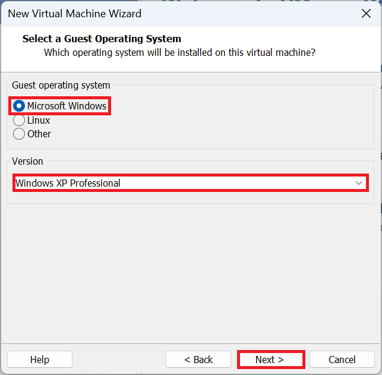
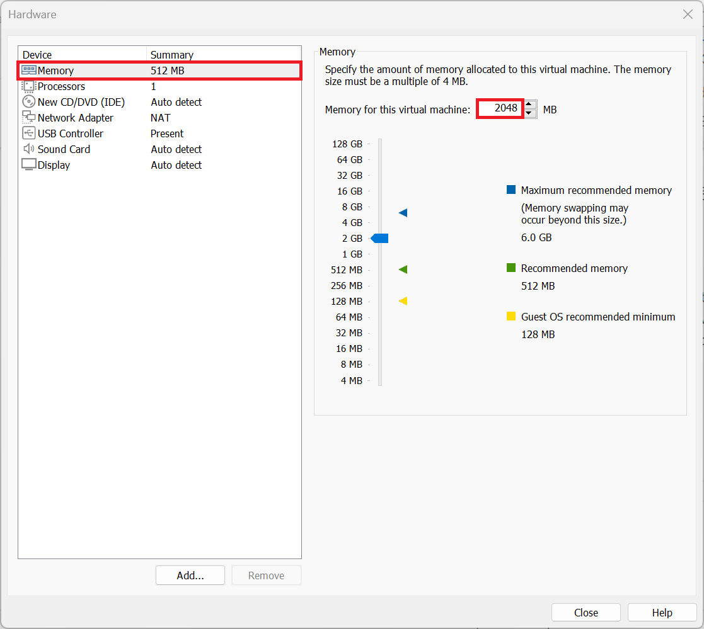
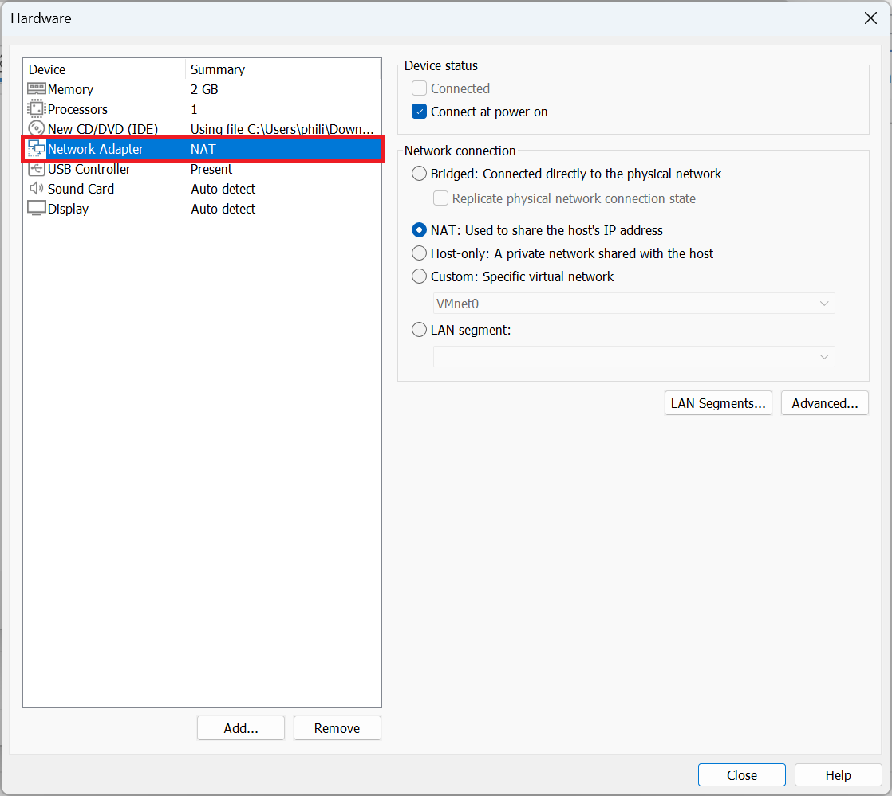
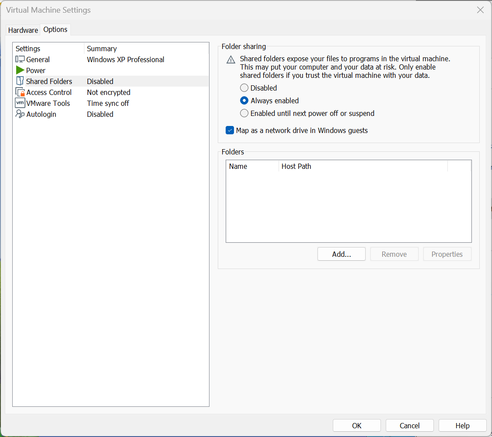

# Windows XP

Setting up a Windows XP Guest using VMware Workstation Player.

## Installation Media

The biggest difficulty to setting up a Windows XP Virtual Machine is obtaining the installation as Microsoft nor its OEMs provided official download links. WinWorld hasn't been updated to include Windows XP:

* [WinWorld Placeholder: Windows XP ISO and Product Key](https://winworldpc.com/product/windows-xp/final) 

<details>
  <summary>Archive.org</summary>

The Website Archive.org hosts each Unofficial Dell Windows XP Reinstallation ISO:

* [Dell Windows XP SP3 Professional Reinstallation ISO](https://archive.org/details/dell.-xp-pro-sp-3)
* [Dell Windows XP SP2 Home Reinstallation ISO](https://archive.org/details/dell-xp-home-sp-2)
* [Dell Windows XP SP2 Media Center Reinstallation ISO](https://archive.org/details/xp-mce-sp-2)

I have tested installation of the three ISOs in a Virtual Machine but as this is an unofficial source and should be used with caution. 

The ISO Checksums can be used to ensure a complete download but these do not match official Dell or Microsoft records as they would have been created from a CD/DVD by an end user:

|ISO|sha256 ISO Checksum|
|---|---|
|XP Pro|a4cf4e53ac9157cf20913a77f438a64e4fa3b908e4e28cb0d2a08d49fa62e49f|
|XP Home|aa0629a1d076c835b49b4b4e97d6f7717813d051cfbeba8d9d69ee6d8f6e8866|
|XP MCE|293a5f6424888f78865e78f33dfd0714bbe54e61dcf27c9c16cacfa08eb4fa0a|

</details>

### Creating a Installation ISO from a CD

Dell Systems came with a Windows XP Reinstallation CD/DVD which can be converted into an ISO using nLite:

* [Using nLite to Create a Windows XP Installation ISO from a Dell Windows Reinstallation CD/DVD](./integration/readme.md)

## WSUS Offline Update

The last version of WSUS Offline Update to support Windows XP was 9.2.5:

* ~~[WSUS Offline Update](https://download.wsusoffline.net/)~~

This no longer works as Microsoft removed the downloads WSUS Offline updates uses from their servers.

<details>
  <summary>Archive.org</summary>

The Website Archive.org appears to host the ISO created from WSUS Offline Update before Microsoft removed Windwos XP downloads from their download servers:

* [WSUS Offline Update Windows XP](https://archive.org/details/wsusoffline-wxp-enu_final)

I have tested installation of the ISO in a Virtual Machine but as this is an unofficial source and should be used with caution. 

</details>

## VMware Tools ISO

The Windows XP drivers for the Windows XP Guest are contained in the VMware Tools Installation ISO. VMware tools for legacy versions of Windows needs to be downloaded from VMware separately:

* [VMware Tools Version 10.0.12 ISO](https://packages.vmware.com/tools/releases/10.0.12/windows/)

## Windows 11 Host or Ubuntu 24.10 Host System Requirements

Your Windows 11 Host PC or Ubuntu Host PC should satisfy the minimum system the system requirements of Windows 11 and have additional overhead to run a Virtual Machine in addition to these requirements. It is recommended to have a Host PC with at least:

* i5 or i7 11th Generation Intel Processor or Newer
* 16 GB RAM
* 1 TB SSD

## Configuring Virtual Hardware for a Windows XP Guest

Select File → New Virtual Machine:


It is recommended to instead use "I Will Install this Operating System Later":


Select Microsoft Windows and Windows XP Professional and select Next:



The VM Name and Location will be shown. Note when used on a Windows 11 Host which is signed in with a Microsoft Account and integrated with OneDrive, the default location will be on OneDrive. The VM can be quite large and the location can be changed to local Documents by removing the OneDrive folder:


Note the name and location as these will be used later.

The default maximum size of the Windows XP Guest is 40 GB which is a bit too restrictive. I recommend increasing this to 120 GB. Note the files on the Windows 11 Host won't be 120 GB but can be up to 120 GB if the Windows XP Guests Virtual Drive is fully occupied with files:


Select Customise Hardware:


The default memory used by the Windows XP Guest is 512 MB (0.5 GB). If the Windows 11 Host PC has ≥32 GB RAM, this can be upped to 4096 MB (4 GB) for increased performance in the Windows XP Guest, if the Windows 11 Host PC has ≤16 GB of RAM, setting this to 4096 MB (4 GB) may throttle the Host PC leading to an overall decreased performance so use 2048 MB (2 GB). The task manager can be opened in the Windows 11 Host PC to view the installed memory (RAM):




The default number of processors cores used by the Windows XP Guest is 1. This can be upped to 2 if the Windows 11 Host has a processor with ≥ 16 cores. If the Windows 11 Host PC has ≤16 cores, setting this to a higher value may throttle the Host PC leading to an overall decreased performance:


The CD/DVD should be configured to load the Dell Windows 7 Reinstallation ISO or Windows XP Volume License Installation iSO:


Windows XP has reached end of life and should be deemed unsafe to use online. The virtual network adaptor is connected by default and can optionally be disabled:



The default USB Controller for Windows XP is USB 2.0 and WIndows XP does not have any drivers for USB 3.0:


The default Sound Card can be used for the Windows XP Guest:


The default Display can be used for the Windows XP Guest:


Select Close and Finish.


## Windows XP Guest Virtual Machine Configuration File

Navigate to the directory on the Windows 11 Host that the Windows XP Guest is installed: 


Look for the `Windows XP.vmx` file:


Open in Notepad or Notepad++ (recommended):


Press `Ctrl+f` to begin a search for an option for example `bios.bootDelay`:


If the line exists it can be modified to a new value. In this case it doesn't exist so can be appended to the end:

```
bios.bootDelay = "20000"
```


The command above will change the time the Windows XP Guest Virtual BIOS displays before selecting the default boot option giving more time to select the option to boot from CD/DVD. This line can be removed post-installation.

<details>
  <summary>Modded ROMs</summary>

The my digital life forums has a post about a modded Virtual BIOS which includes a Dell SLIC 1.0 compatible with Dell Windows XP Professional OEM SLP. These ROMs are not supported by Microsoft or Dell (but then neither is Windows XP). You will need to log into their forums to view the files:

* [My Digital Life: SLIC 1.0, 2.1 Mod](https://forums.mydigitallife.net/threads/vmware-workstation-esxi-bios-efi-slic-mod.64693/#post-1132133)

Extract the downloaded file and navigate to the `17.6.0 Modded ROMs` folder. Rename `WORKSTATION_17.6.0_DELL2.7_SLIC_BIOS.440_(497).ROM` to `modded_BIOS.440.ROM` and copy the modded ROM to the directory of the Windows XP Guest. Update the Virtual Machine Configuration file to:

```
bios440.filename = "modded_BIOS.440.ROM"
```

Note if the corresponding ROM is not found in the directory the above line of code will prevent the Windows XP Guest from booting.

</details>

## Installing the Windows XP Guest OS

Select the Windows XP Guest and select Play:


The WIndows XP Setup will begin:


Press `↵` to continue:


Press `F8` to proceed:


Press `↵` to install Windows XP on the unpartitioned space:


Select Format the System using NTFS (quick):


Select Customise and change the Regional Settings, Location and Keyboard Settings:


Select Next:


Input your User Name and select Next:


Input the computer name and select Next:


Select the Time Zone and select Next:


Select Typical Settings:


Select No, leaving WORKGROUP as the default and then next:


Select OK:


Select OK:


You will be taken to the Windows XP Desktop:


## Installing VMware Tools

Select Player → Removable Devices → CD/DVD → Settings:


Load the `VMware-tools-windows-10.0.12-4448496.iso`:


Windows XP has autoplay enabled by default and the VMware Tools installation should begin. If it does not go to Computer in the Windows XP Guest and start the setup from the CD/DVD:


Select Next:


Select Next:


Select Install:


Select Yes to restart:


The Windows XP Guest will restart and the window in the Windows 11 Host can now be resized, resizing the Windows XP Guest:


On a Windows 11 Host, drag and drop to the Windows XP Guest is bi-directional. On a Ubuntu Host, drag and drop from the Ubuntu Host to the Windows XP Guest works but does not work from the Windows XP Guest to Ubuntu Host (Shared Folders can be configured for that). The Standalone Windows XP Service Pack 4 Update can be copied to the Windows XP Guest:


## Windows Product Activation Timer

The Windows Security Center Notifications can be changed:


Notifications about Automatic Updates and Virus Protection can be Disabled:


The activation status can be seen by going to Start and selecting run:


and then inputting:

```
%systemroot%\system32\oobe\msoobe.exe /a
```


Details about the days remaining in grace period can be seen:


If a Windows XP Professional Volume License ISO was used, Windows XP Professional should be activated. Alternatively if a Dell Windows XP Professional OEM on a Virtual Machine with a SLIC 1.0 passed through, Windows XP Professional should be activated.

## Shared Folders

Create a new folder on the Windows 11 Host or Ubuntu 24.10 Host PC called `vmshared`:


Select Player → Manage → Virtual Machine Settings:


Select Options → Shared Folders and change the setting to Always Enabled and check Map Network Drive:



Select Add, select the folder vmshared on the Windows 11 Host PC or Ubuntu 24.10 Host PC and then next:


Select Enable this Share and Finish:


The shared folder is now mapped as a network drive in the Windows XP Guest:


And the file created on the Windows XP Guest in this shared folder can be accessed in the Windows 11 Host or Ubuntu 24.10 Host:


## USB Devices

A USB Device can be passed through from the Windows 11 Host or Ubuntu 24.10 to the Windows XP Guest:


The Device Drivers for the USB Device and software can be installed in the Windows 7 Guest.

## Serial Ports

It is also possible to pass a Serial Port from the Windows 11 Host or Ubuntu 24.10 Host to the Windows XP Guest. Select Player → Manage → Virtual Machine Settings:


Under hardware select Add...


Then select Serial Port:


This needs to be done when the Windows 7 Guest is powered off. In this example, the Windows 11 Host doesn't have a Serial Port, so I'm not going to add a Serial Port.

Note the Serial Port number should be configured in the Device Manager in the Windows 11 Host, then added to the Windows XP Guest, then the Serial Port number should be configured in the Windows XP Guest. It is recommended to do this one at a time, to avoid confusion between Serial Ports.

The Windows XP Guest is now setup:

* [VMware Installation Guide](../readme.md)