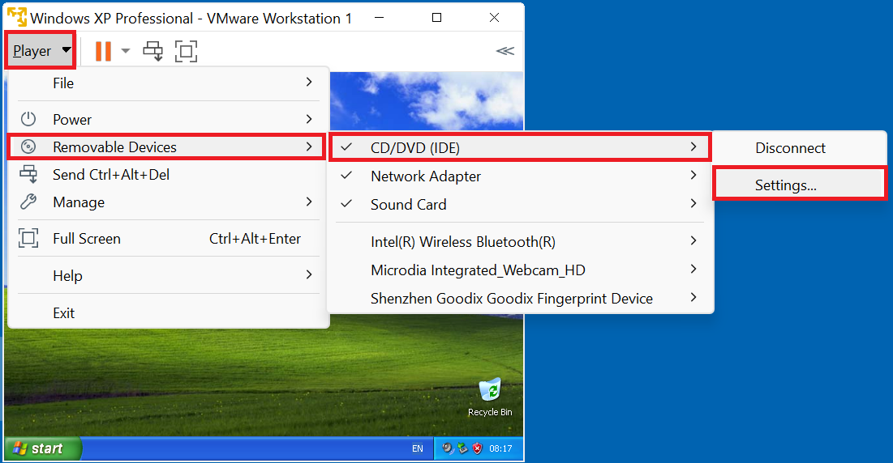
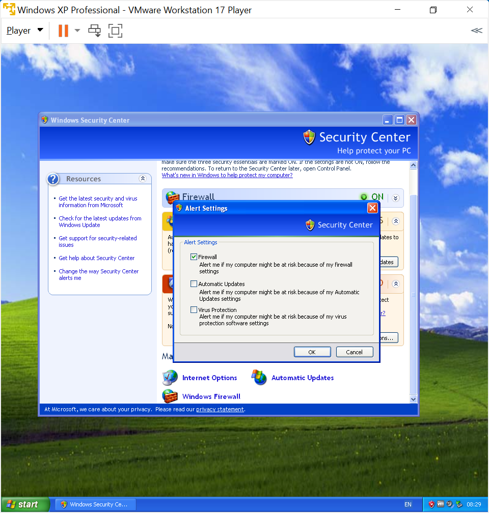
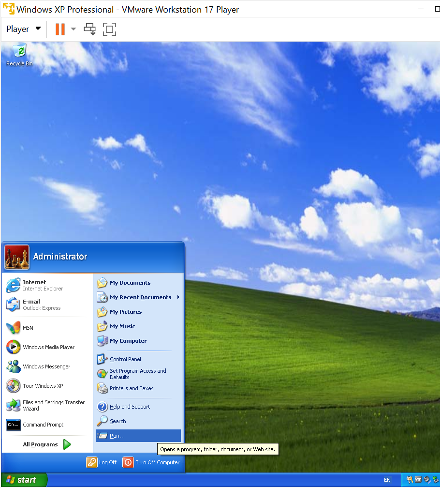
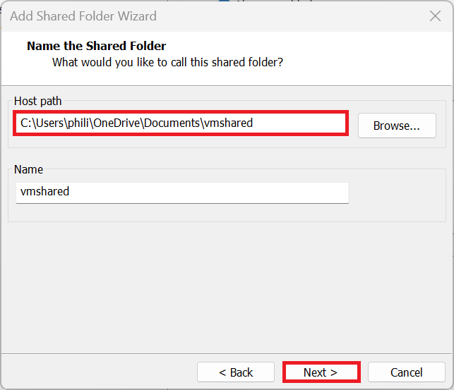

# Windows XP

Setting up a Windows XP Guest using VMware Workstation Player.

## Installation Media

The biggest difficulty to setting up a Windows XP VM is obtaining the installation as Microsoft nor its OEMs provided official download links.

### Windows XP Windows Volume License Installation ISO

The Windows XP Professional SP3 Volume License ISO and associated Product Key is not yet available to download on WinWorld:

* [WinWorld Placeholder: Windows XP ISO and Product Key](https://winworldpc.com/product/windows-xp/final) 

Which otherwise lists abandoned Windows Versions from Windows 1 through to Windows ME.

The Windows XP Professional SP3 Volume License ISO was used for large organisations such as Universities, Governments and Enterprise companies and is preferred for a Windows XP Professional VM as it activates offline and does not have the hassles of Microsoft Product Activation.

<details>
  <summary>Unofficial Links (Untested)</summary>

Unofficially a copy of the Volume License ISO appears to be listed here:

* [Archive Org Microsoft Windows XP SP3 Reinstallation ISO](https://archive.org/details/win-xp-pro-sp-3-x-86)

Unofficially Volume License Keys are listed on this GitHub repository:

* [GitHub: Windows XP All Keys Universal Product Key Collection All Keys](https://github.com/Fuwn/xp)

</details>

### Dell Windows XP OEM Reinstallation ISO

The Dell Windows XP Reinstallation ISO is also not available to download from WinWorld but can be created by converting a Windows XP Reinstallation CD/DVD to an ISO using ImgBurn.

OEM SLP activation is not carried out by default when using a Windows XP Virtual Machine as the Virtual Machine lacks the SLIC 1.0, SLIC 2.0 (Windows Vista Business Edition to Windows XP Professional Downgrade Rights) or SLIC 2.1 (Windows 7 Professional Downgrade Rights to Windows XP Professional Downgrade Rights) in the Virtual BIOS by default. This will result in a 30 Day Trial.

<details>
  <summary>30 Day Trial...</summary>

Windows XP has an initial 30 day grace period. After this grace period you are forcefully logged out and can only login to activate.

</details>

<details>
  <summary>Unofficial Links (Untested)</summary>

Unofficially a copy of the Dell Windows XP SP3 Reinstallation ISO appears to be listed here:

* [Archive Org Dell Windows XP SP3 Reinstallation ISO](https://archive.org/details/dell.-xp-pro-sp-3)

</details>

### Windows XP Mode

The mouse in the Windows XP Mode VM cannot be used in VMware and installation of VMware tools gives a black screen resulting in poor performance:

<details>
  <summary>Windows XP Mode</summary>

Windows XP Mode can be downloaded from:

* [Windows XP Mode](https://download.cnet.com/windows-xp-mode/3000-18513_4-77683344.html)

A VM can be created from this by renaming the file `WindowsXPMode_en-us.exe` to `WindowsXPMode_en-us.zip`. Then extracting the zip file and going to the sources folder. Then renaming the `xpm` to `xpm.zip` and renaming the `VirtualXPVHD` to `VirtualXP.VHD`. The `VirtualXP.VHD` can be used as a Virtual Drive in VMware Workstation Player but results in a VM where the mouse doesn't work. Installation of VMware tools gives a black screen.

</details>

## VMware Tools ISO

The Windows XP drivers for the Windows XP Guest are contained in the VMware Tools Installation ISO. VMware tools for legacy versions of Windows needs to be downloaded from VMware separately:

* [VMware Tools Version 10.0.12 ISO](https://packages.vmware.com/tools/releases/10.0.12/windows/)

## Windows 11 Host or Ubuntu 24.10 Host System Requirements

Your Windows 11 Host PC or Ubuntu Host PC should satisfy the minimum system the system requirements of Windows 11 and have additional overhead to run a Virtual Machine in addition to these requirements. It is recommended to have a Host PC with at least:

* i5 or i7 11th Generation Intel Processor or Newer
* 16 GB RAM
* 1 TB SSD

## Configuring Virtual Hardware for a Windows XP Guest

Select File → New Virtual Machine:


It is recommended to instead use "I Will Install this Operating System Later":


Select Microsoft Windows and Windows XP Professional and select Next:


The VM Name and Location will be shown. Note when used on a Windows 11 Host which is signed in with a Microsoft Account and integrated with OneDrive, the default location will be on OneDrive. The VM can be quite large and the location can be changed to local Documents by removing the OneDrive folder:


Note the name and location as these will be used later.

The default maximum size of the Windows XP Guest is 40 GB which is a bit too restrictive. I recommend increasing this to 120 GB. Note the files on the Windows 11 Host won't be 120 GB but can be up to 120 GB if the Windows XP Guests Virtual Drive is fully occupied with files:


Select Customise Hardware:


The default memory used by the Windows XP Guest is 512 MB (0.5 GB). If the Windows 11 Host PC has ≥32 GB RAM, this can be upped to 4096 MB (4 GB) for increased performance in the Windows XP Guest, if the Windows 11 Host PC has ≤16 GB of RAM, setting this to 4096 MB (4 GB) may throttle the Host PC leading to an overall decreased performance so use 2048 MB (2 GB). The task manager can be opened in the Windows 11 Host PC to view the installed memory (RAM):


The default number of processors cores used by the Windows XP Guest is 1. This can be upped to 2 if the Windows 11 Host has a processor with ≥ 16 cores. If the Windows 11 Host PC has ≤16 cores, setting this to a higher value may throttle the Host PC leading to an overall decreased performance:


The CD/DVD should be configured to load the Dell Windows 7 Reinstallation ISO or Windows XP Volume License Installation iSO:


Windows XP has reached end of life and should be deemed unsafe to use online. The virtual network adaptor is connected by default and can optionally be disabled:


The default USB Controller for Windows XP is USB 2.0 and WIndows XP does not have any drivers for USB 3.0:


The default Sound Card can be used for the Windows XP Guest:


The default Display can be used for the Windows XP Guest:


Select Close and Finish.


## Windows XP Guest Virtual Machine Configuration File

Navigate to the directory on the Windows 11 Host that the Windows XP Guest is installed: 


Look for the `Windows XP.vmx` file:


Open in Notepad or Notepad++ (recommended):


Press `Ctrl+f` to begin a search for an option for example `bios.bootDelay`:


If the line exists it can be modified to a new value. In this case it doesn't exist so can be appended to the end:

```
bios.bootDelay = "20000"
```

The command above will change the time the Windows 7 Guest Virtual BIOS displays before selecting the default boot option giving more time to select the option to boot from CD/DVD. This line can be removed post-installation.

<details>
  <summary>SLIC 2.1 Passthrough</summary>

If the Windows 11 Host PC came with a Windows 10 Professional OEM License, it has upgrade rights to Windows 11 Professional and downgrade right to Windows 7 Professional. The downgrade rights to Windows 7 Professional can be used by passing through the SLIC 2.1 to the Virtual Machine by adding the line to the Virtual Machines Configuration File:

```
acpi.passthru.slic = "TRUE"
acpi.passthru.slicvendor = "TRUE"
SMBIOS.reflecthost = "TRUE"
```

Note if the Windows 11 Host PC doesn't have a SLIC 2.1, the above lines of code will prevent the Windows 7 Guest from booting and should be removed.

<details>
  <summary>Modded ROMs</summary>

The my digital life forums has a post about a modded Virtual BIOS which includes a Dell SLIC 2.1 compatible with Dell Windows 7 Professional OEM SLP. These ROMs are not supported by Microsoft or Dell (but then neither is Windows 7). You will need to log into their forums to view the files:

* [My Digital Life: SLIC 2.1 Mod](https://forums.mydigitallife.net/threads/vmware-workstation-esxi-bios-efi-slic-mod.64693/#post-1132133)

Extract the downloaded file and navigate to the `17.6.0 Modded ROMs` folder. Rename `WORKSTATION_17.6.0_DELL2.7_SLIC_EFI20-64.ROM` to `EFI20-64.ROM` and copy the modded ROM to the directory of the Windows 7 Guest. Update the Virtual Machine Configuration file to:

```
efi20-64.filename = "modded_EFI20-64.ROM"
```

Note if the corresponding ROM is not found in the directory the above line of code will prevent the Windows 7 Guest from booting.

</details>

</details>












```
bios.bootDelay = "20000"
```

```
bios440.filename = "modded_BIOS.440.ROM"
```


```
oobe/msoobe /a
```